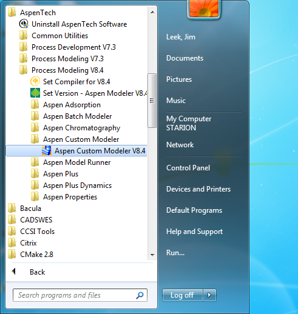
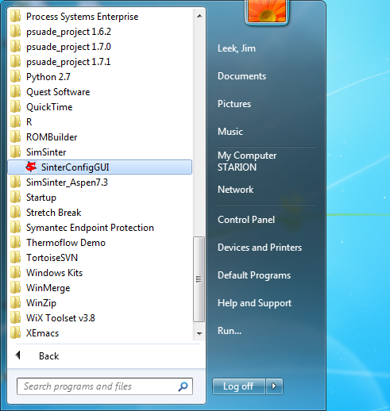
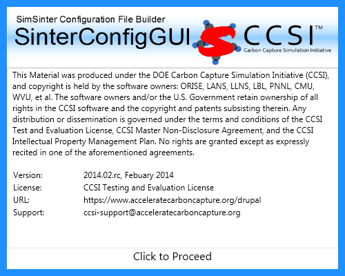
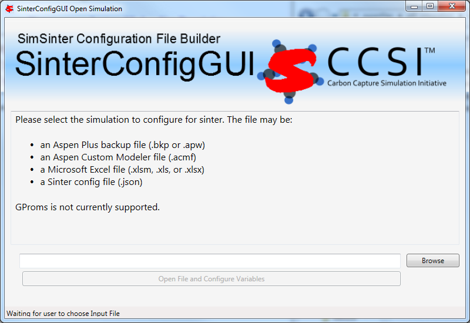
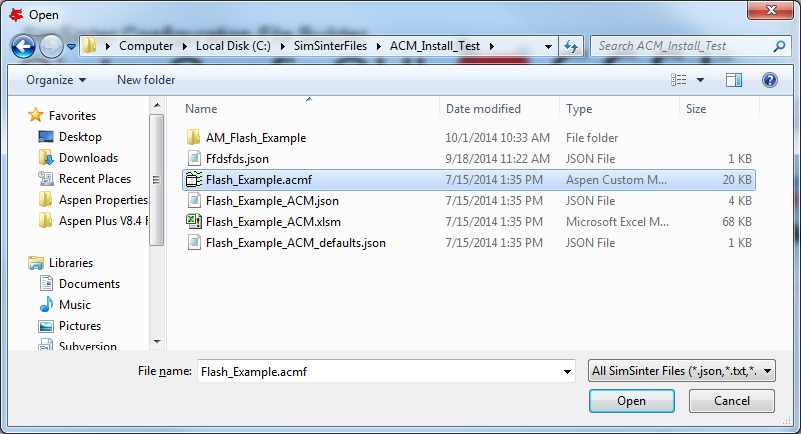
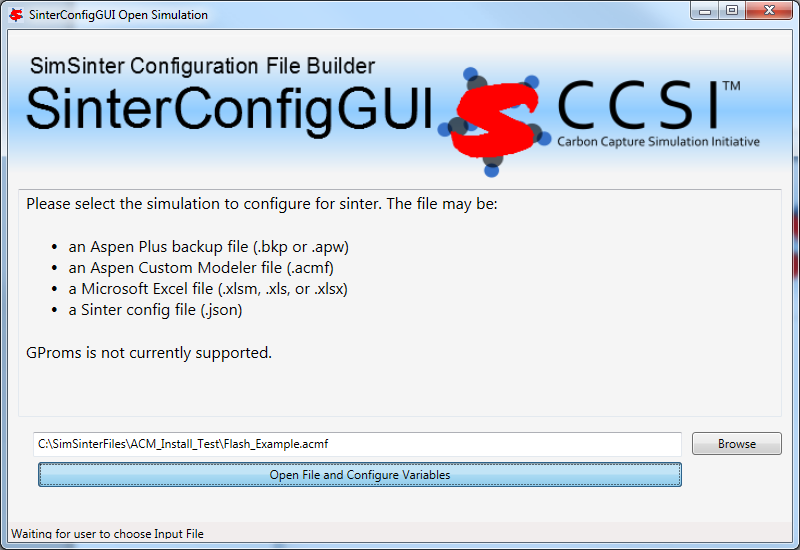
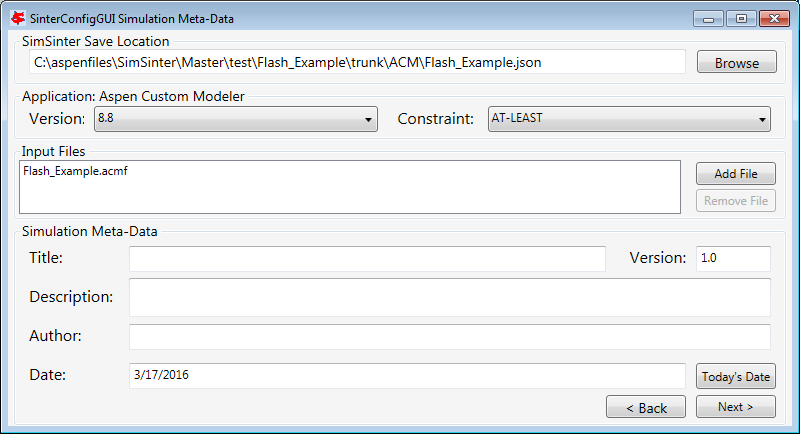

SimSinter Installation Guide
============================

Prerequisites
-------------

SimSinter 3.x has been tested with Windows 10, Windows 11, Windows Server
2019 and Windows Server 2022.

To get any use out of SimSinter you will also need at least one
simulator to use it with. SimSinter has been tested with:

-  Aspen Plus, version 12 or newer

-  Aspen Custom Modeler (ACM), version 12 or newer

-  Microsoft Excel, 2021 or newer

Basic Installation 
------------------

**Third Party Software Installation**

In order to run a simulation, the correct simulator is also required.
SimSinter may use Aspen Plus, Aspen Custom Modeler, or Microsoft
Excel. Please install the appropriate simulator by following the
simulator vendor provided documentation.

**Product Installation**

To install SimSinter:

1. Download SimSinterInstaller.msi from
   https://github.com/CCSI-Toolset/SimSinter/releases

2. Run SimSinterInstaller.msi

3. Click Next

4. Accept the terms of the License agreement

5. Click either the “Typical” or “Complete” button; either will install
   all of SimSinter. The Custom button may be used to not install
   certain features.

6. Click the Install button.

7. Give permission for SimSinter to install, enter administrator login
   information if necessary.

8. Click “Finish” to complete the installation.

9. SimSinter should now be installed and entered into the Windows
   registry. It should now be accessible by either Microsoft Excel or
   the command line tools.

Installation Test 
-----------------

Three tests are included with the SimSinter installation that will allow
testing that SimSinter has installed correctly. There is one test for
each of the three supported simulators. The tests demonstrate running
SimSinter from Microsoft Excel, so to run them you must have Microsoft
Excel installed.

To test, please choose the appropriate simulator below and follow the
instructions.

**Opening a Simulation with SinterConfigGUI**

This is a simple test to make sure that SimSinter is installed
correctly, and can correctly open your simulation and simulator.

1. Choose a simulation to open, and make sure you have the correct
   simulator installed. For example, I will be using the Aspen Custom
   Modeler simulation included with the SimSinter install. So I should
   make sure that I have both Aspen Custom Modeler installed, and
   SimSinter, as shown in Figure 1.

..

|image6| \ |image7|

Figure 1

2. Open SinterConfigGUI by selecting it from the start menu, as in
   Figure 1.

3. Initially the SimSinter Configuration File Builder splash screen
   displays, as shown in Figure 2. Either click the splash screen to
   proceed or wait 10 seconds for the screen to close automatically.

|image8|

Figure 2: SimSinter Splash Screen

4. | The SinterConfigGUI Open Simulation window displays as shown in
     Figure 3. Click “Browse” to select the file to open and then click
     “Open File and Configure Variables” to open the file. The user can
     either open a fresh ACM simulation (.acmf file) or an existing
     Sinter configuration file. In these instructions, a fresh
     simulation is opened.
   | It may take a few minutes after clicking the button to
     SinterConfigGUI to move on. It must open your simulator, so you
     must expect it to take at least as long as your simulator normally
     takes to open. For Aspen products that use a networked license
     server, this may take as long as a few minutes. During that
     SinterConfigGUI will remain on the Open File Page, but the
     “Attempting to Open Aspen” message will appear at the bottom of the
     window.

..

|image9|

Figure 3: SinterConfigGUI Open Simulation Window

5. Click browse and select your file. I will be opening the ACM
   demonstration file included with SimSinter in
   C:\\SimSinterFiles\\ACM_Install_Test, as in Figure 4.

|image10|

Figure 4: Selecting the simulation file to open

6. Click “Open File and Configure Variables”

..

|image11|

Figure 5: Clicking Open File button

7. It may take a few minutes after clicking the button to
   SinterConfigGUI to move on. It must open your simulator, so you must
   expect it to take at least as long as your simulator normally takes
   to open. For Aspen products that use a networked license server, this
   may take as long as a few minutes. During that time SinterConfigGUI
   will remain on the Open Simulation window, but the “Attempting to
   Open Aspen” message will appear at the bottom of the window.

8. | The SinterConfigGUI Simulation Meta-Data window displays as shown
     in Figure 6.
   | Also, the Aspen Custom Modeler has started up in the background.
     This is so the user can observe things about the simulation in
     question as they work on the configuration file
   | If you see an error instead, please attempt to debug the issue, or
     contact CCSI support at ccsi-support@acceleratecarboncapture.org

|image12|

Figure 6: Meta-Data window

9. If you see the window in Figure 6, SimSinter is working properly and
   can properly open simulators. If you wish to continue this tutorial,
   and configure the simulation, please see the tutorial section of the
   SimSinter User Manual. It includes sections on configuring
   simulations for Aspen Custom Modeler, Aspen Plus, and Microsoft
   Excel.

