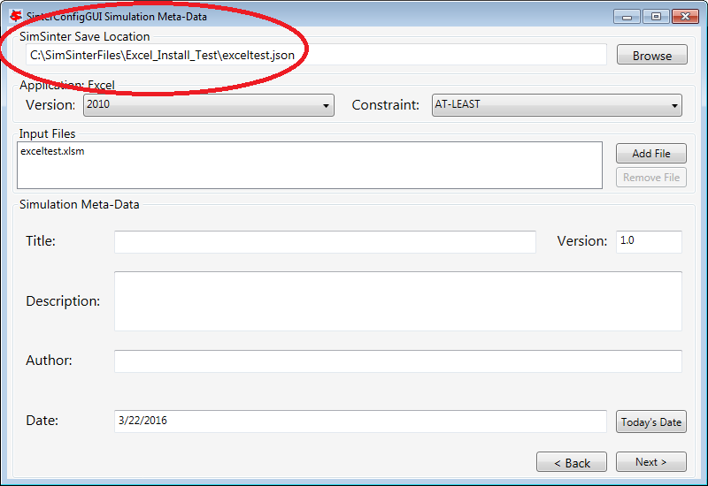
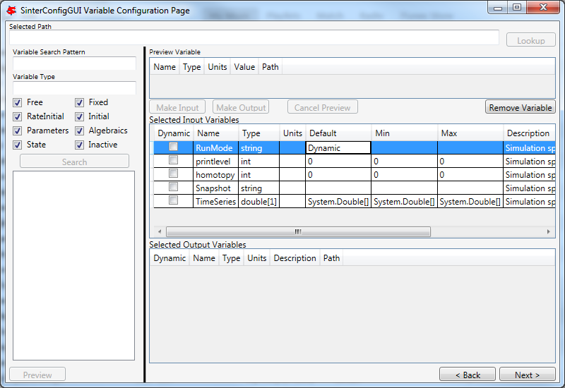
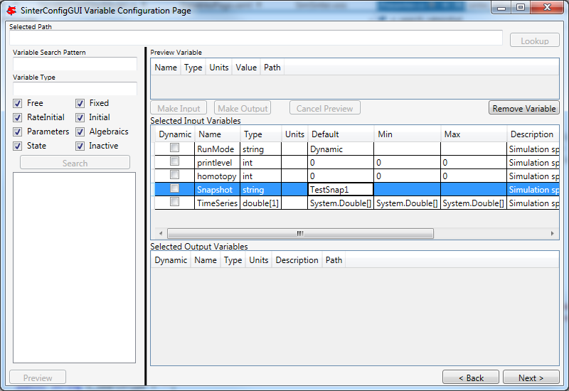
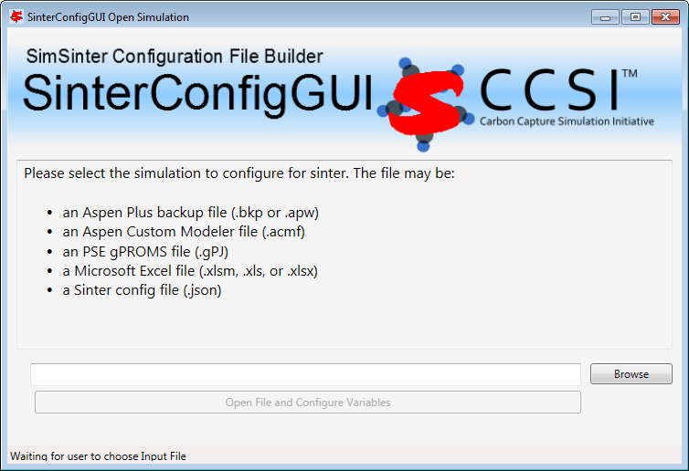
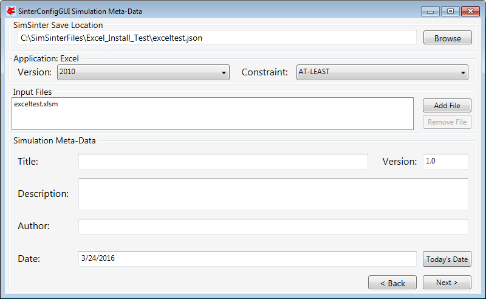

|image1|\ |image2|\ |image3|\ |image4|\ |image5|\ |New_DOE_Logo_Color_042808|

|CCSI_color_CS3_TM_300dpi.png|

SimSinter

Technical Manual

Version 3.0.0

October 2023

Copyright (c) 2012 - 2023

**Copyright Notice**

SimSinter was produced under the DOE Carbon Capture Simulation
Initiative (CCSI), and is copyright (c) 2012 - 2023 by the software
owners: Oak Ridge Institute for Science and Education (ORISE), TRIAD
National Security, LLC., Lawrence Livermore National Security, LLC., The
Regents of the University of California, through Lawrence Berkeley
National Laboratory, Battelle Memorial Institute, Pacific Northwest
Division through Pacific Northwest National Laboratory, Carnegie Mellon
University, West Virginia University, Boston University, the Trustees of
Princeton University, The University of Texas at Austin, URS Energy &
Construction, Inc., et al.. All rights reserved.

NOTICE. This Software was developed under funding from the U.S.
Department of Energy and the U.S. Government consequently retains
certain rights. As such, the U.S. Government has been granted for itself
and others acting on its behalf a paid-up, nonexclusive, irrevocable,
worldwide license in the Software to reproduce, distribute copies to the
public, prepare derivative works, and perform publicly and display
publicly, and to permit other to do so.

**License Agreement**

SimSinter Copyright (c) 2012 - 2023, by the software owners: Oak Ridge
Institute for Science and Education (ORISE), TRIAD National Security,
LLC., Lawrence Livermore National Security, LLC., The Regents of the
University of California, through Lawrence Berkeley National Laboratory,
Battelle Memorial Institute, Pacific Northwest Division through Pacific
Northwest National Laboratory, Carnegie Mellon University, West Virginia
University, Boston University, the Trustees of Princeton University, The
University of Texas at Austin, URS Energy & Construction, Inc., et al.
All rights reserved.

Redistribution and use in source and binary forms, with or without
modification, are permitted provided that the following conditions are
met:

1. Redistributions of source code must retain the above copyright
   notice, this list of conditions and the following disclaimer.

2. Redistributions in binary form must reproduce the above copyright
   notice, this list of conditions and the following disclaimer in the
   documentation and/or other materials provided with the distribution.

3. Neither the name of the Carbon Capture Simulation Initiative, U.S.
   Dept. of Energy, the National Energy Technology Laboratory, Oak Ridge
   Institute for Science and Education (ORISE), TRIAD National Security,
   LLC., Lawrence Livermore National Security, LLC., the University of
   California, Lawrence Berkeley National Laboratory, Battelle Memorial
   Institute, Pacific Northwest National Laboratory, Carnegie Mellon
   University, West Virginia University, Boston University, the Trustees
   of Princeton University, the University of Texas at Austin, URS
   Energy & Construction, Inc., nor the names of its contributors may be
   used to endorse or promote products derived from this software
   without specific prior written permission.

THIS SOFTWARE IS PROVIDED BY THE COPYRIGHT HOLDERS AND CONTRIBUTORS "AS
IS" AND ANY EXPRESS OR IMPLIED WARRANTIES, INCLUDING, BUT NOT LIMITED
TO, THE IMPLIED WARRANTIES OF MERCHANTABILITY AND FITNESS FOR A
PARTICULAR PURPOSE ARE DISCLAIMED. IN NO EVENT SHALL THE COPYRIGHT OWNER
OR CONTRIBUTORS BE LIABLE FOR ANY DIRECT, INDIRECT, INCIDENTAL, SPECIAL,
EXEMPLARY, OR CONSEQUENTIAL DAMAGES (INCLUDING, BUT NOT LIMITED TO,
PROCUREMENT OF SUBSTITUTE GOODS OR SERVICES; LOSS OF USE, DATA, OR
PROFITS; OR BUSINESS INTERRUPTION) HOWEVER CAUSED AND ON ANY THEORY OF
LIABILITY, WHETHER IN CONTRACT, STRICT LIABILITY, OR TORT (INCLUDING
NEGLIGENCE OR OTHERWISE) ARISING IN ANY WAY OUT OF THE USE OF THIS
SOFTWARE, EVEN IF ADVISED OF THE POSSIBILITY OF SUCH DAMAGE.

You are under no obligation whatsoever to provide any bug fixes,
patches, or upgrades to the features, functionality or performance of
the source code ("Enhancements") to anyone; however, if you choose to
make your Enhancements available either publicly, or directly to
Lawrence Berkeley National Laboratory, without imposing a separate
written license agreement for such Enhancements, then you hereby grant
the following license: a non-exclusive, royalty-free perpetual license
to install, use, modify, prepare derivative works, incorporate into
other computer software, distribute, and sublicense such enhancements or
derivative works thereof, in binary and source code form. This material
was produced under the DOE Carbon Capture Simulation.

Table of Contents
=================

`SimSinter <#_Toc433811324>`__ `1 <#_Toc433811324>`__

`1.0 Reporting Issues <#_Toc433811326>`__ `1 <#_Toc433811326>`__

`2.0 Version Log <#_Toc147996611>`__ `1 <#_Toc147996611>`__

`3.0 Introduction <#_Toc369266330>`__ `1 <#_Toc369266330>`__

`3.1 Motivating Example <#_Toc446493743>`__ `2 <#_Toc446493743>`__

`3.2 Features List <#_Toc369266332>`__ `2 <#_Toc369266332>`__

`3.3 Overview: What a User Needs to Know About SimSinter and this
Manual <#_Toc369266333>`__ `3 <#_Toc369266333>`__

`4.0 Tutorial <#_Toc369266334>`__ `4 <#_Toc369266334>`__

`4.1 Writing SimSinter Configuration Files <#_Ref336973638>`__
`4 <#_Ref336973638>`__

`4.1.1 Creating a Steady State Aspen Custom Modeler Sinter Configuration
File <#_Toc369266337>`__ `4 <#_Toc369266337>`__

`4.1.2 Creating an Aspen Plus Sinter Configuration
File <#_Toc369266338>`__ `17 <#_Toc369266338>`__

`4.1.3 Creating a Microsoft Excel Sinter Configuration
File <#_Toc369266339>`__ `27 <#_Toc369266339>`__

`4.1.4 Creating a Dynamic ACM Simulation <#_Ref446492691>`__
`36 <#_Ref446492691>`__

`4.2 Setting up Microsoft Excel → SimSinter <#_Toc369266340>`__
`51 <#_Toc369266340>`__

`4.3 Using CSVConsoleSinter <#_Toc369266343>`__ `55 <#_Toc369266343>`__

`4.4 Using ConsoleSinter <#_Toc369266346>`__ `56 <#_Toc369266346>`__

`4.5 Using DefaultBuilder <#_Toc429988678>`__ `56 <#_Toc429988678>`__

`5.0 Understanding SimSinter <#_Toc429988679>`__ `57 <#_Toc429988679>`__

`5.1 Steady State Simulation <#_Toc429988680>`__ `57 <#_Toc429988680>`__

`5.2 Dynamic Simulation <#_Toc429988681>`__ `57 <#_Toc429988681>`__

`5.2.1 Overview <#_Toc147996629>`__ `57 <#_Toc147996629>`__

`5.2.2 TimeSeries <#_Toc147996630>`__ `57 <#_Toc147996630>`__

`5.2.3 Snapshot <#_Toc147996631>`__ `58 <#_Toc147996631>`__

`5.2.4 Variables in Dynamic Simulations <#_Toc147996632>`__
`58 <#_Toc147996632>`__

`6.0 SIMSinter Configuration File <#_Toc429988682>`__
`60 <#_Toc429988682>`__

`6.1 Overview <#_Ref368926033>`__ `60 <#_Ref368926033>`__

`6.2 Address Strings <#_Toc369266353>`__ `61 <#_Toc369266353>`__

`6.3 Settings <#_Toc369266357>`__ `63 <#_Toc369266357>`__

`6.4 Additional Variable Information <#_Toc369266361>`__
`64 <#_Toc369266361>`__

`6.5 JSON Sinter Configuration Format <#_Toc369266367>`__
`65 <#_Toc369266367>`__

`7.0 USAGE Information <#_Toc369266370>`__ `71 <#_Toc369266370>`__

`7.1 Support <#_Toc369266371>`__ `71 <#_Toc369266371>`__

`7.2 SinterConfigGUI Hot-Keys <#_Toc369266372>`__
`71 <#_Toc369266372>`__

`7.2.1 Initial Page / Open File Page <#_Toc147996642>`__
`71 <#_Toc147996642>`__

`7.2.2 Meta-Data Page <#_Toc147996643>`__ `72 <#_Toc147996643>`__

`7.2.3 Variable Configuration Page <#_Toc147996644>`__
`73 <#_Toc147996644>`__

`7.2.4 Vector Defaults Configuration Page <#_Toc147996645>`__
`74 <#_Toc147996645>`__

`7.3 Unit of Measurement Handling <#_Toc147996646>`__
`74 <#_Toc147996646>`__

`7.4 Using the Included Command Line Tools <#_Toc369266373>`__
`75 <#_Toc369266373>`__

`8.0 Debugging <#_Toc369266381>`__ `75 <#_Toc369266381>`__

`8.1 How to Debug <#_Toc369266382>`__ `75 <#_Toc369266382>`__

List of Figures
===============

`Figure 1: Start menu, SinterConfigGUI. <#_Toc429988697>`__
`4 <#_Toc429988697>`__

`Figure 2: SimSinter Configuration File Builder splash
screen. <#_Toc429988698>`__ `5 <#_Toc429988698>`__

`Figure 3: SinterConfigGUI Open Simulation window. <#_Toc429988699>`__
`6 <#_Toc429988699>`__

`Figure 4: SimSinter Save Location. <#_Toc429988700>`__
`7 <#_Toc429988700>`__

`Figure 5: Set Constraints on the Simulator Version <#_Toc147996654>`__
`8 <#_Toc147996654>`__

`Figure 6: Additional Files may be attached via the Input Files
list. <#_Toc147996655>`__ `9 <#_Toc147996655>`__

`Figure 7: SinterConfigGUI Variable Configuration Page
window. <#_Toc429988701>`__ `10 <#_Toc429988701>`__

`Figure 8: Search In Progress Dialog Box <#_Toc429988702>`__
`11 <#_Toc429988702>`__

`Figure 9: SinterConfigGUI Variable Configuration Page window,
Flash.i_port.Connection(“Feed”).T variable selected. <#_Toc429988703>`__
`11 <#_Toc429988703>`__

`Figure 10: SinterConfigGUI Variable Configuration Page window, Preview
Variable frame. <#_Toc429988704>`__ `12 <#_Toc429988704>`__

`Figure 11: SinterConfigGUI Variable Configuration Page window, Feed.T
in Selected Input Variables. <#_Toc429988705>`__ `13 <#_Toc429988705>`__

`Figure 12: SinterConfigGUI Variable Configuration Page window, Input
Variable Name, Description, Min, and Max text boxes. <#_Toc429988706>`__
`14 <#_Toc429988706>`__

`Figure 13: SinterConfigGUI Variable Configuration Page window, preview
before making an output variable. <#_Toc429988707>`__
`15 <#_Toc429988707>`__

`Figure 14: SinterConfigGUI Variable Configuration Page window, created
output variable. <#_Toc429988708>`__ `16 <#_Toc429988708>`__

`Figure 15: Start menu, SinterConfigGUI. <#_Toc429988709>`__
`17 <#_Toc429988709>`__

`Figure 16: SimSinter Configuration File Builder splash
screen. <#_Toc429988710>`__ `17 <#_Toc429988710>`__

`Figure 17: SinterConfigGUI Open Simulation window. <#_Toc429988711>`__
`18 <#_Toc429988711>`__

`Figure 18: SimSinter Save Location. <#_Toc429988712>`__
`19 <#_Toc429988712>`__

`Figure 19: Set simulation version constraint <#_Toc147996668>`__
`20 <#_Toc147996668>`__

`Figure 20: Additional Files may be attached via the Input Files
list. <#_Toc147996669>`__ `21 <#_Toc147996669>`__

`Figure 21: SinterConfigGUI Variable Configuration Page
window. <#_Toc429988713>`__ `22 <#_Toc429988713>`__

`Figure 22: SinterConfigGUI Variable Configuration Page window, Variable
Tree nodes. <#_Toc429988714>`__ `23 <#_Toc429988714>`__

`Figure 23: SinterConfigGUI Variable Configuration Page window, Preview
Variable. <#_Toc429988715>`__ `24 <#_Toc429988715>`__

`Figure 24: SinterConfigGUI Variable Configuration Page window, Input
Variable Name, Description, Min, and Max text boxes. <#_Toc429988716>`__
`25 <#_Toc429988716>`__

`Figure 25: SinterConfigGUI Variable Configuration Page window, Output
Variable Name, Description, Min, and Max text boxes. <#_Toc429988717>`__
`26 <#_Toc429988717>`__

`Figure 26: Start menu, SinterConfigGUI <#_Toc429988718>`__
`27 <#_Toc429988718>`__

`Figure 27: SimSinter Configuration File Builder splash
screen. <#_Toc429988719>`__ `27 <#_Toc429988719>`__

`Figure 28: SinterConfigGUI Open Simulation window. <#_Toc429988720>`__
`28 <#_Toc429988720>`__

`Figure 29: SimSinter Save Location. <#_Toc429988721>`__
`29 <#_Toc429988721>`__

`Figure 30: Set Constraints on the Excel Version <#_Toc147996679>`__
`30 <#_Toc147996679>`__

`Figure 31: Additional files can be attached <#_Toc147996680>`__
`31 <#_Toc147996680>`__

`Figure 32: SinterConfigGUI Variable Configuration Page
window. <#_Toc429988722>`__ `32 <#_Toc429988722>`__

`Figure 33: SinterConfigGUI Variable Configuration Page window, Variable
Tree. <#_Toc429988723>`__ `33 <#_Toc429988723>`__

`Figure 34: SinterConfigGUI Variable Configuration Page window, Name,
Description, Default, Min, and Max text boxes. <#_Toc429988724>`__
`34 <#_Toc429988724>`__

`Figure 35: SinterConfigGUI Variable Configuration Page window, Output
Variable. <#_Toc429988725>`__ `35 <#_Toc429988725>`__

`Figure 36: Start menu, SinterConfigGUI. <#_Toc429988726>`__
`36 <#_Toc429988726>`__

`Figure 37: SimSinter Configuration File Builder splash
screen. <#_Toc429988727>`__ `36 <#_Toc429988727>`__

`Figure 38: SinterConfigGUI Open Simulation window. <#_Toc429988728>`__
`37 <#_Toc429988728>`__

`Figure 39: SimSinter Save Location. <#_Toc429988729>`__
`38 <#_Toc429988729>`__

`Figure 40:Set Constraints on the Simulator Version <#_Toc147996689>`__
`39 <#_Toc147996689>`__

`Figure 41: Begin adding additional files to the
simulation <#_Toc147996690>`__ `40 <#_Toc147996690>`__

`Figure 42: Attaching the tasksnap and snapshot
files <#_Toc147996691>`__ `41 <#_Toc147996691>`__

`Figure 43: The snapshot files have been attached. <#_Toc147996692>`__
`42 <#_Toc147996692>`__

`Figure 44: SinterConfigGUI Variable Configuration Page for Dynamic
ACM. <#_Toc429988730>`__ `43 <#_Toc429988730>`__

`Figure 45: ACM Tools → SnapShot, Snapshot Management
window. <#_Toc429988731>`__ `44 <#_Toc429988731>`__

`Figure 46: SnapShot setting default set. <#_Toc429988732>`__
`45 <#_Toc429988732>`__

`Figure 47: Variable Search, Search In Progress
window. <#_Toc429988733>`__ `45 <#_Toc429988733>`__

`Figure 48: Selecting a Steady State variable. <#_Toc429988734>`__
`46 <#_Toc429988734>`__

`Figure 49: Make a Dynamic variable. <#_Toc429988735>`__
`47 <#_Toc429988735>`__

`Figure 50: Making a Dynamic output variable. <#_Toc429988736>`__
`48 <#_Toc429988736>`__

`Figure 51: Making a Steady State output variable. <#_Toc429988737>`__
`49 <#_Toc429988737>`__

`Figure 52: Vector Default Initialization window. <#_Toc429988738>`__
`49 <#_Toc429988738>`__

`Figure 53: A default TimeSeries. <#_Toc429988739>`__
`50 <#_Toc429988739>`__

`Figure 54: Microsoft Excel, Flash_Example_ACS.xlsm. <#_Toc429988740>`__
`54 <#_Toc429988740>`__

`Figure 55: Microsoft Excel, Flash_Example_ACS.xlsm
results. <#_Toc429988741>`__ `54 <#_Toc429988741>`__

| To obtain support for the products within this package, please send an
  e-mail to
| ccsi-support@acceleratecarboncapture.org.

SimSinter

1. Reporting Issues

To report an issue, please send an e-mail to
ccsi-support@acceleratecarboncapture.org.

2. Version Log

+-----------------------+---------+---------+-------------------------+
| Product               | Version | Release | Description             |
|                       | Number  | Date    |                         |
+=======================+=========+=========+=========================+
| SimSinter             | 3.0.0   | 10/     | Updates to copyright    |
|                       |         | 31/2023 | and license dates,      |
|                       |         |         | update of               |
|                       |         |         | prerequisites, and      |
|                       |         |         | removal of units        |
|                       |         |         | conversion test.        |
+-----------------------+---------+---------+-------------------------+
| SimSinter             | 2.0.1   | 08/     | License update (no      |
|                       |         | 15/2019 | functional changes)     |
+-----------------------+---------+---------+-------------------------+
| SimSinter             | 2.0.0   | 03/     | Initial Open Source     |
|                       |         | 31/2018 | release                 |
+-----------------------+---------+---------+-------------------------+
| SimSinter             | 201     | 04/     | 2016 May Release-       |
|                       | 6.04.00 | 20/2016 |                         |
|                       |         |         | Added DMF integration   |
|                       |         |         | and additional          |
|                       |         |         | meta-data to Sinter     |
|                       |         |         | Config Files for use by |
|                       |         |         | the DMF.                |
+-----------------------+---------+---------+-------------------------+
| SimSinter             | 201     | 11/     | 2015 November IAB       |
|                       | 5.10.00 | 20/2015 | Release –               |
|                       |         |         | Added PSE gPROMS        |
|                       |         |         | support. Please see the |
|                       |         |         | SimSinter gPROMS        |
|                       |         |         | Technical Manual.       |
+-----------------------+---------+---------+-------------------------+
| SimSinter             | 20      | 06/     | 2015 June incremental   |
|                       | 15.6.00 | 30/2015 | Release – Added Dynamic |
|                       |         |         | ACM support.            |
+-----------------------+---------+---------+-------------------------+
| SimSinter             | 20      | 10/     | 2014 October IAB        |
|                       | 14.10.0 | 31/2014 | Release – Added FOQUS   |
|                       |         |         | Integration.            |
+-----------------------+---------+---------+-------------------------+

3. Introduction

SimSinter is a standard interface library for driving single-process
Windows\ :sup:`®`-based simulation software. SimSinter has been tested
on:

-  Aspen Plus\ :sup:`®` 12.x and 14.x

-  Aspen Custom Modeler\ :sup:`®` (ACM) 12.x and 14.x,

-  Microsoft\ :sup:`®` Excel\ :sup:`®` 2021

When called, SimSinter can open the simulator, initialize the
simulation, set variables in the simulation, run the simulation, and get
the resulting output variables from the simulation. SimSinter is an
integral part of the Turbine Gateway and every other Carbon Capture
Simulation Initiative (CCSI) tool that runs process simulations.

1. Motivating Example

Aspen Plus runs a single process simulation by itself just fine, so why
is SimSinter necessary? SimSinter is most useful for running sets of
simulations designed by some other software.

A common use case is parameter studies for uncertainly quantification
(UQ). A new carbon capture process simulation was designed where the
reaction parameters for carbon capture and release were determined
experimentally. Those experiments provided bounds for the reaction
parameters, but how the process would perform with in that range still
had to be determined.

A set of 40,000 runs was designed in the PSUADE Uncertainty
Quantification tool. Using TurbineClient/PSUADESinter the 40,000 jobs
were sent to the Gateway. The Gateway launched 100 ACM instances via
SimSinter and ran all 40,000 jobs over three days. The results of the
simulation were retreived from the Gateway with FOQUS. Those results
were loaded back into PSUADE. With PSUADE the effectiveness of the
simulation and under what conditions the simulation would have problems
were analyzed.

2. Features List

SimSinter can interface to the following simulators:

1. Aspen Plus

2. ACM (Steady State, Dynamic, and Optimization run modes)

3. PSE gPROMS

4. Microsoft Excel

SimSinter can be called from the following interfaces:

1. The Turbine Gateway (or a standalone Gateway). The Gateway can be
   called either from the Framework for Optimization and Quantification
   of Uncertainty and Sensitivity (FOQUS) or TurbineClient.
   TurbineClient can take JSON, PSUADE, or CSV (Comma Separated Values,
   a common spreadsheet format) files.

5. Microsoft Excel. The SimSinter installation includes a spreadsheet
   that can be used with any Sinter configuration file to perform a
   single run or series of runs on the user’s workstation.

6. The standalone tools included with the SimSinter installation such as
   ConsoleSinter, which can run a single run or series of runs on the
   user’s workstation.

SimSinter also installs the following helper tools:

-  SinterConfigGUI: Used to generate JSON format configuration files by
   enabling the user to interface with Aspen or Excel.

-  ConsoleSinter: Takes JSON format inputs to perform a run or series of
   runs locally.

-  CSVConsoleSinter: Takes .csv to perform a series of runs locally.

-  DefaultBuilder: Generates a JSON format file of defaults, pulled from
   the current values of the inputs in the simulation file. (This file
   is useful for generating some example inputs for running
   ConsoleSinter.)

   1. Overview: What a User Needs to Know About SimSinter and this
      Manual

If SimSinter is to be used with gPROMS, another manual is required.
gPROMS is so different from the Aspen and Excel simulators, that it
could not be well integrated with this document. Please see the
SimSinter gPROMS Technical Manual.

SimSinter itself must be run on a machine that has the simulator and all
of the necessary licenses installed. For example, SimSinter could run
Aspen Plus simulations on a desktop computer that has Aspen Plus
installed and the necessary Aspen Plus licenses. This includes
configuring simulations with the SinterConfigGUI. SinterConfigGUI
interfaces with the simulator to interrogate the simulation. So
SimSinter and the simulator must exist on the same machine.

However, a user that does not have a simulator license may still use
SimSinter if they have access to a remote computer that has the
simulator installed, and also has the Turbine Science Gateway installed.
In this case, the user can send their simulations to the Gateway, and
the Gateway computer runs SimSinter and the simulator. (Or, it may, farm
the actually running of SimSinter and the simulator off to another
machine that has the licenses.)

There are two ways a user can run SimSinter:

1. Remotely by the Turbine Gateway or by a standalone Gateway
   installation.

2. Locally (on the same machine the user is using) by Microsoft Excel or
   by one of the tools included with the SimSinter installation.

For the remainder of this manual it is assumed that the user is running
SimSinter locally. Special cases for the Gateway are documented as
needed.

To drive a simulation SimSinter requires at least two files, which
should be in the same directory.

1. The simulation file to run SimSinter. This file is simulator
   specific. The file defines the simulation for the simulator. For
   example, for Aspen Plus this file can be a .bkp or .apw file.

2. The Sinter configuration file is a JSON file that gives meta-data
   about the simulation. Including all the input and output variables
   the simulation writer thinks the user might find useful, including
   name, type, defaults, units, and possible minimum and maximum values.

For some simulations additional files are required, for example, some
ACM simulations have a snapshot file, or additional simulator
functionality contained in a DLL. The files should be listed in the
SimSinter configuration file so that Turbine and the Data Management
Framework are aware of them, and can place them in the correct
directories for running the simulation.

SimSinter produces inputs and outputs in a simple JSON format. JSON is
easy for programs to parse and manipulate, but it is not easy to read,
nor is it used by most scientific tools. Furthermore, even though
SimSinter only writes the output variables requested in the Sinter
configuration file, the user is usually only interested in a small
subset of those variables.

Therefore, aside from the Excel SimSinter Interface, there are tools for
converting the outputs to two other useful formats: PSUADE format and
CSV format. A user can perform sets of runs in CSV format directly with
the included tool CSVConsoleSinter. Otherwise, refer to the
documentation for TurbineClient, which includes tools for converting to
and from PSUADE and CSV format, as well as doing Gateway runs with those
formats.

4. Tutorial

This section consists of tutorials for simulation writers and users to
perform the most common tasks with SimSinter. These tutorials focus on
running SimSinter locally, as there are separate tutorials for running
Aspen with the Gateway available in the FOQUS User Manual.

This manual also does not cover running gPROMS with SimSinter. Please
see the SimSinter gPROMS Technical Manual.

1. Writing SimSinter Configuration Files

Description

The SimSinter configuration files are intended to be written by a user
with an intimate understanding of the simulation that the files are run
on, usually the simulation writer. Any simulation has a gargantuan list
of possible input and output variables. The primary job of the
configuration file is to pare the list down to just the variables of
interest.

The JSON format is difficult to write. A Graphical User Interface (GUI)
has been developed that makes this task much simpler.

The following sections contain demonstrations on writing files for three
of the supported simulators, Aspen Plus, ACM, and Microsoft Excel. For a
tutorial on using SimSinter with gPROMS, see the SimSinter gPROMS
Technical Manual. Before reading these sections, read Section 6.1
Overview, which provides and overview of the components of a Sinter
configuration file. This section assumes the user has read Section 5.1
Steady State Simulation.

1. Creating a Steady State Aspen Custom Modeler Sinter Configuration
   File

1. Open the “SinterConfigGUI” from the “Start” menu, as shown in Figure
   1.

|image6|

Figure : Start menu, SinterConfigGUI.

7. Initially the SimSinter Configuration File Builder splash screen
   displays, as shown in Figure 2. Either click the “splash screen” to
   proceed, or wait 10 seconds for the screen to close automatically.

|image7|

Figure : SimSinter Configuration File Builder splash screen.

8. The SinterConfigGUI Open Simulation window displays as shown in
   Figure 3. Click “Browse” to select the file to open, or type the
   filename into the text box and click “Open File and Configure
   Variables” to open the file. The user can either open a fresh ACM
   simulation (.acmf file) or an existing Sinter configuration file. In
   these instructions, the ACM test included in the SimSinter
   installation at
   C:\\SimSinterFiles\\ACM_Install_Test\\Flash_Example.acmf is opened.

After clicking “Open File and Configure Variables,” it may take a few
minutes for the SinterConfigGUI to proceed. The SinterConfigGUI must
open the simulator, taking as long as the simulator normally takes to
open. For Aspen products that use a networked license server, this may
take a few minutes. During that time the SinterConfigGUI remains on the
Open File Page and the “Attempting to Open Aspen” message appears at the
bottom of the window.

|image8|

Figure : SinterConfigGUI Open Simulation window.

9. The SinterConfigGUI Simulation Meta-Data window displays as shown in
   Figure 4, and ACM has started up in the background. This is so the
   user can observe things about the simulation in question as they work
   on the configuration file. The first and most important piece of
   meta-data is the “SimSinter Save Location” at the top of the window.
   This is where the Sinter configuration file is saved. The system
   suggests a file location and name. SimSinter automatically saves
   changes to this file. If the built in test files are being used for
   this tutorial, it is recommend that the name of the save file be
   changed before proceeding to avoid overwriting the configuration that
   came with the installation.

|image9|

Figure : SimSinter Save Location.

10. | SimSinter allows the user to restrict the simulator versions that
      maybe used with the simulation. By default SimSinter will set the
      restriction to be at least the newest version of the simulator on
      the current machine. However, the user may select any version of
      the simulator supported by SimSinter, and may constrain it in any
      of the following ways:
    | ANY: SimSinter will attempt to launch the newest version of the
      simulator available, and will not throw an error, no matter which
      version is actually launched.
    | AT-LEAST: SimSinter will launch the newest version of the
      simulator available, but it will throw an error if the version
      launched is older than the recommended version.
    | REQUIRED: SimSinter will attempt to launch the recommended
      version, if it does not exist, SimSinter will throw an error and
      will not run the simulation.
    | RECOMMENDED: SimSinter will attempt to launch the recommended
      version, if it can’t be found, the newest version available will
      be launched. If that version is older than the recommended
      version, SimSinter will throw an error.
    | |image10|

Figure : Set Constraints on the Simulator Version

11. | Some simulations have additional files they require to run. For
      example, dynamic simulations often have a snapshot.snp file so
      that the simulation can be restarted from a known state.
    | This simulation does not have any additional files, so a full
      tutorial will not be given here. For more information see the
      Dynamic ACM simulation section 4.1.4 . But these additional files
      may be attached to the simulation via the Input Files section. The
      simulation file itself is always included in the Input Files, and
      cannot be removed.
    | |image11|

Figure : Additional Files may be attached via the Input Files list.

12. The SinterConfigGUI Variable Configuration Page window displays as
    shown the Figure. The ACM Setting variables are already included in
    the Selected Input Variables. For this simulation, “homotopy” is off
    by default; therefore, it is set to “0.” There are three other
    settings, “TimeSeries,” “Snapshot,” and “RunMode.” Leave “RunMode”
    set to “Steady State.” “Snapshot” and “TimeSeries” are only for
    Dynamic simulations, so leave them alone as well.

On the left of the window is a “Variable Search” box. This search is
exactly the same as “Variable Find” on the “Tools” menu in ACM. Refer to
the ACM documentation for details on search patterns.

|image12|

Figure : SinterConfigGUI Variable Configuration Page window.

13. Enter search for everything in the Flash block (“Flash.~”). The
    Search In Progress dialog box may appear, as shown below.

|image13|

Figure : Search In Progress Dialog Box

14. Select the “Flash.i_port.Connection(“Feed”).T” scalar variable.

|image14|

Figure : SinterConfigGUI Variable Configuration Page window,
Flash.i_port.Connection(“Feed”).T variable selected.

15. Double-click the variable, press “Enter,” or click “Preview” or
    “Lookup” to display the variable in the Preview Variable frame to
    confirm the correct variable is selected.

|image15|

Figure : SinterConfigGUI Variable Configuration Page window, Preview
Variable frame.

16. Confirm visually that it is the intended variable. Click “Make
    Input” and the variable displays in the “Selected Input Variables”
    section as shown in Figure 11. Leave the “Dynamic” check box on the
    far left cleared. Dynamic variables are only for use with Dynamic
    simulations, and the RunMode is set to “Steady State.”

|image16|

| Figure : SinterConfigGUI Variable Configuration Page window,
| Feed.T in Selected Input Variables.

17. To rename the Selected Input Variable name (e.g.,
    Flash.i_port.Connection(“Feed”).T) to a more descriptive name, click
    the “Name” text box and then enter a name. A user can also enter a
    “Description” and the “Min” and “Max” ranges, as shown in Figure 12.

|image17|

| Figure : SinterConfigGUI Variable Configuration Page window,
| Input Variable Name, Description, Min, and Max text boxes.

18. To add an output variable (for example, the fraction of the output
    vapor stream that is water), scroll down to find
    “Flash.o_port_vap.z(“WATER”).” Select it and then preview it as
    described in Step 10.

|image18|

| Figure : SinterConfigGUI Variable Configuration Page window,
| preview before making an output variable.

19. Click “Make Output.” This variable has a unit “lbmol/libmol” as
    shown in Figure 14.

|image19|

Figure : SinterConfigGUI Variable Configuration Page window, created
output variable.

20. The simulation is now set up. To save the configuration file, click
    “Finish” or press “CTRL+S.” The file is saved to the location that
    was set on the Meta-Data window. A user can save a copy under a
    different name, by navigating back to the Meta-Data window using
    “Back,” and then changing the name. This creates a second version of
    the file.

A user also needs to close the ACM simulator, which remains open after
SinterConfigGUI finishes.

1. Creating an Aspen Plus Sinter Configuration File

1. Open the “SinterConfigGUI” from the “Start” menu, as shown in Figure
   13.

|image20|

Figure : Start menu, SinterConfigGUI.

21. Initially the SimSinter Configuration File Builder splash screen
    displays, as shown in Figure 16. Either click the “splash screen” to
    proceed, or wait 10 seconds for the screen to close automatically.

|image21|

Figure : SimSinter Configuration File Builder splash screen.

22. The SinterConfigGUI Open Simulation window displays as shown in
    Figure 17. Click “Browse” to select the file to open, or type in a
    filename and click “Open File and Configure Variables” to open the
    file. The user can either open a fresh Aspen Plus simulation (.bkp
    or .apw file) or an existing Sinter configuration file (.json). In
    these instructions a fresh copy of the included Aspen Plus flash
    column test is opened, it can be found at
    C:\\SimSinterFiles\\Aspen_Plus_Install_Test\\Flash_Example.bkp.

After clicking “Open File and Configure Variables,” it may take a few
minutes for the SinterConfigGUI to proceed. The SinterConfigGUI must
open the simulator, taking as long as the simulator normally takes to
open. For Aspen products that use a networked license server, this may
take a few minutes. During that time the SinterConfigGUI remains on the
Open File Page and the “Attempting to Open Aspen” message appears at the
bottom of the window.

|image22|

Figure : SinterConfigGUI Open Simulation window.

23. The SinterConfigGUI Simulation Meta-Data window displays as shown in
    the Figure, and Aspen Plus started up in the background. This is so
    the user can observe things about the simulation in question as they
    work on the configuration file.

The first and most important piece of meta-data is the “SimSinter Save
Location” at the top of the window. This is where the Sinter
configuration file is saved. The system suggests a file location and
name. The user should confirm this is the intended location of the files
to not accidently overwrite other files.

|image23|

Figure : SimSinter Save Location.

24. | SimSinter allows the user to restrict the simulator versions that
      maybe used with the simulation. By default SimSinter will set the
      restriction to be: at least the newest version of the simulator on
      the current machine. However, the user may select any version of
      the simulator supported by SimSinter, and may constrain it in any
      of the following ways:
    | ANY: SimSinter will attempt to launch the newest version of the
      simulator available, and will not throw an error, no matter which
      version is actually launched.
    | AT-LEAST: SimSinter will launch the newest version of the
      simulator available, but it will throw an error if the version
      launched is older than the recommended version.
    | REQUIRED: SimSinter will attempt to launch the recommended
      version, if it does not exist, SimSinter will throw an error and
      will not run the simulation.
    | RECOMMENDED: SimSinter will attempt to launch the recommended
      version, if it can’t be found, the newest version available will
      be launched. The that version is older than the recommended
      version, SimSinter will throw an error.
    | |image24|

Figure : Set simulation version constraint

25. | Some simulations have additional files they require to run. For
      example, dynamic simulations often have a snapshot.snp file so
      that the simulation can be restarted from a known state.
    | This simulation does not have any additional files, so a full
      tutorial will not be given here. For more information see the
      Dynamic ACM simulation section 4.1.4 . But these additional files
      may be attached to the simulation via the Input Files section. The
      simulation file itself is always included in the Input Files, and
      cannot be removed.
    | |image25|

Figure : Additional Files may be attached via the Input Files list.

26. Enter the remaining fields to provide the meta-data to describe the
    simulation that was just opened and then click “Next” (or save,
    “CTRL+S”).

27. The SinterConfigGUI Variable Configuration Page window displays as
    shown the Figure below. Aspen Plus has no settings; therefore, there
    are no settings variables in the “Selected Input Variables” section.

Unlike ACM, Aspen Plus has the variable tree on the left side, so the
user can explore the tree as they do in Aspen Plus Tools → Variable
Explorer.

|image26|

Figure : SinterConfigGUI Variable Configuration Page window.

A user can expand the Variable Tree nodes for searching as shown in
Figure 22.

|image27|

Figure : SinterConfigGUI Variable Configuration Page window, Variable
Tree nodes.

28. Type the node address in the “Selected Path” text box and then press
    “Enter” or click “Lookup” or “Preview.” This automatically expands
    the tree and selects the entered variable in the Variable Tree, as
    shown the Figure.

The “Selected Path” text box is useful for Copy and Paste from Aspen
Plus’ Variable Explorer.

|image28|

Figure : SinterConfigGUI Variable Configuration Page window, Preview
Variable.

29. To make the temperature of the Flash chamber an input variable,
    click “Make Input.” Optionally, a user can also rename the Variable
    and “Description,” and enter the “Min” and “Max” fields by clicking
    the appropriate text box and then entering the applicable
    information, as shown in the Figure.

|image29|

| Figure : SinterConfigGUI Variable Configuration Page window,
| Input Variable Name, Description, Min, and Max text boxes.

30. Select an output variable, click “Preview,” and then click “Make
    Output.” Optionally, rename the Variable and the “Description,” and
    enter the “Min” and “Max” fields by clicking the appropriate text
    box and then entering the applicable information, as shown in the
    Figure.

|image30|

| Figure : SinterConfigGUI Variable Configuration Page window,
| Output Variable Name, Description, Min, and Max text boxes.

31. The simulation is now set up. To save the configuration file, click
    “Finish” or press “CTRL+S.” The file is saved to the location that
    was set on the Meta-Data window. A user can save a copy under a
    different name, by navigating back to the Meta-Data window using
    “Back,” and then changing the name. This creates a second version of
    the file.

    1. Creating a Microsoft Excel Sinter Configuration File

1. Open the “SinterConfigGUI” from the “Start” menu, as shown in Figure
   26.

|image31|

Figure : Start menu, SinterConfigGUI

32. Initially the SimSinter Configuration File Builder splash screen
    displays, as shown in Figure 27. Either click the “splash screen” to
    proceed, or wait 10 seconds for the screen to close automatically.

|image32|

Figure : SimSinter Configuration File Builder splash screen.

33. The SinterConfigGUI Open Simulation window displays as shown in
    Figure 28. Click “Browse” to select the file to open and then click
    “Open File and Configure Variables” to open the file. The user can
    either open a fresh Microsoft Excel simulation (.xlsm, .xls, or
    .xlsx file) or an existing Sinter configuration file. In these
    instructions, a fresh copy of the BMI test is opened. It can be
    found at: C:\\SimSinterFiles\\Excel_Install_Test\\exceltest.xlsm.

|image33|

Figure : SinterConfigGUI Open Simulation window.

Microsoft Excel started up in the background. This is so the user can
observe things about the simulation in question as they work on the
configuration file.

34. The SinterConfigGUI Simulation Meta-Data window displays as shown in
    Figure 29. The first and most important piece of meta-data is the
    “SimSinter Save Location” at the top of the window. This is where
    the Sinter configuration file is saved. The system suggests a file
    location and name. The user should confirm that this is the intended
    location of the files to not accidently overwrite other files.

|image34|

Figure : SimSinter Save Location.

35. | SimSinter allows the user to restrict the simulator versions that
      maybe used with the simulation. By default SimSinter will set the
      restriction to be: at least the newest version of the simulator on
      the current machine. However, the user may select any version of
      the simulator supported by SimSinter, and may constrain it in any
      of the following ways:
    | ANY: SimSinter will attempt to launch the newest version of the
      simulator available, and will not throw an error, no matter which
      version is actually launched.
    | AT-LEAST: SimSinter will launch the newest version of the
      simulator available, but it will throw an error if the version
      launched is older than the recommended version.
    | REQUIRED: The REQUIRED constraint is not recommended for use with
      Excel. SimSinter cannot choose which Excel to launch, so it will
      always launch the newest version available. However, if the
      version launched is different than the recommended version,
      SimSinter will throw an error.
    | RECOMMENDED: The RECOMMENDED constraint is not recommened for use
      with Excel. Because SimSinter cannot choose which Excel to launch,
      the behavior of RECOMMENDED will be exactly the same as AT-LEAST.
    | |image35|

Figure : Set Constraints on the Excel Version

36. | Some simulations have additional files they require to run. For
      example, dynamic ACM simulations often have a snapshot.bak file so
      that the simulation can be restarted from a known state.
    | This simulation does not have any additional files, so a full
      tutorial will not be given here. For more information see the
      Dynamic ACM simulation section 4.1.4 . But these additional files
      may be attached to the simulation via the Input Files section. The
      simulation file itself is always included in the Input Files, and
      cannot be removed.
    | |image36|

Figure : Additional files can be attached

37. Enter the remaining fields to provide the meta-data to describe the
    simulation that was just opened and then click “Next” (or save,
    “CTRL+S”).

38. The SinterConfigGUI Variable Configuration Page window displays as
    shown below. Excel has a single setting, “macro.” If the Excel
    spreadsheet that is being use has a macro that should be run after
    Sinter sets the inputs, but before Sinter gets the outputs, enter
    the macros name in the “Name” text box. If the default is left
    blank, no macro is run (unless a name is supplied in the input
    variables when running the simulation).

|image37|

Figure : SinterConfigGUI Variable Configuration Page window.

39. The Excel simulation has the same Variable Tree structure as Aspen
    Plus, as shown in the Figure. Only the variables in the “active
    section” of the Excel spreadsheet appear in the Variable Tree. If a
    cell does not appear the user has to manually enter the cell into
    the “Selected Path” text box.

**Note:** Row is first in the Variable Tree, yet column is first in the
path.

|image38|

Figure : SinterConfigGUI Variable Configuration Page window, Variable
Tree.

40. Select an input variable (such as, “height$C$4”) as shown the
    Figure. A user can enter a “Name,” “Description,” “Default,” “Min,”
    and “Max” by clicking in the applicable text box.

|image39|

| Figure : SinterConfigGUI Variable **Configuration** Page window,
| Name, Description, Default, Min, and Max text boxes.

41. Enter an output variable (such as, “BMI$C$3”), by selecting the
    variables in the Variable Tree, clicking “Preview,” and then
    clicking “Make Output.”

|image40|

Figure : SinterConfigGUI Variable Configuration Page window, Output
Variable.

42. The simulation is now set up. To save the configuration file, click
    “Finish” or press “CTRL+S.” The file is saved to the location that
    was set on the Meta-Data window. A user can save a copy under a
    different name, by navigating back to the Meta-Data window using
    “Back,” and then changing the name. This creates a second version of
    the file.

    1. Creating a Dynamic ACM Simulation

1. Open the “SinterConfigGUI” from the “Start” menu, as shown in Figure
   30.

|image41|

Figure : Start menu, SinterConfigGUI.

43. Initially the SimSinter Configuration File Builder splash screen
    displays, as shown in Figure 31. Either click the “splash screen” to
    proceed, or wait 10 seconds for the screen to close automatically.

|image42|

Figure : SimSinter Configuration File Builder splash screen.

44. The SinterConfigGUI Open Simulation window displays as shown in
    Figure 32. Click “Browse” to select the file to open, or type a
    filename in and click “Open File and Configure Variables” to open
    the file. The user can either open a fresh ACM simulation (.acmf
    file) or an existing Sinter configuration file. In these
    instructions, the ACM test included in the SimSinter installation at
    C:\\SimSinterFiles\\ACM_Dynamic_Test\\BFB.acmf is opened.

After clicking “Open File and Configure Variables,” it may take a few
minutes for the SinterConfigGUI to proceed. The SinterConfigGUI must
open the simulator, taking as long as the simulator normally takes to
open. For Aspen products that use a networked license server, this may
take a few minutes. During that time the SinterConfigGUI remains on the
Open File Page and the “Attempting to Open Aspen” message appears at the
bottom of the window.

|image43|

Figure : SinterConfigGUI Open Simulation window.

45. The SinterConfigGUI Simulation Meta-Data window displays as shown in
    Figure 39. And ACM has started up in the background. This is so the
    user can observe things about the simulation in question as they
    work on the configuration file. The first and most important piece
    of meta-data is the “SimSinter Save Location” at the top of the
    window. This is where the Sinter configuration file is saved. The
    system suggests a file location and name. SimSinter automatically
    saves changes to this file. If the built in test files are being
    used for this tutorial, it is recommend that the name of the save
    file be changed before proceeding to avoid overwriting the
    configuration that came with the installation.

Complete the remaining fields to provide the meta-data to describe the
simulation that was just opened and then click “Next.” Clicking “Next”
automatically saves, but the user can also save at any time by pressing
“Ctrl+S.”

|image44|

Figure : SimSinter Save Location.

46. | SimSinter allows the user to restrict the simulator versions that
      maybe used with the simulation. By default SimSinter will set the
      restriction to be, at least the newest version of the simulator on
      the current machine. However, the user may select any version of
      the simulator supported by SimSinter, and may constrain it in any
      of the following ways:
    | ANY: SimSinter will attempt to launch the newest version of the
      simulator available, and will not throw an error, no matter which
      version is actually launched.
    | AT-LEAST: SimSinter will launch the newest version of the
      simulator available, but it will throw an error if the version
      launched is older than the recommended version.
    | REQUIRED: SimSinter will attempt to launch the recommended
      version, if it does not exist, SimSinter will throw an error and
      will not run the simulation.
    | RECOMMENDED: SimSinter will attempt to launch the recommended
      version, if it can’t be found, the newest version available will
      be launched. The that version is older than the recommended
      version, SimSinter will throw an error.\ |image45|

Figure :Set Constraints on the Simulator Version

47. | In order for the simulation to be able to load snapshots, it
      requires two files located in the AM_BFB subdirectory:
      snapshot.bak and tasksnap.bak. These can be attached to the
      simulation by clinking “Add File” in the “Input Files” box on the
      Meta-Data Page.
    | |image46|

Figure : Begin adding additional files to the simulation

48. | That will open a file browser window where the files may be
      selected.
    | |image47|

Figure : Attaching the tasksnap and snapshot files

49. | Then the files will appear, with their relative paths, in the
      Input Files box.
    | Fill out the rest of the meta-data entries, and click “Next” to
      proceed.
    | |image48|

Figure : The snapshot files have been attached.

50. The SinterConfigGUI Variable Configuration Page window displays as
    shown in Figure 44. The ACM Setting variables are already included
    in the “Selected Input Variables.” For this simulation, change
    “RunMode” to “Dynamic.”

On the left of the window is a “Variable Search” box. This search is
exactly the same as “Variable Find” on the “Tools” menu in ACM. Refer to
the ACM documentation for details on search patterns.

|image49|

Figure : SinterConfigGUI Variable Configuration Page for Dynamic ACM.

51. The “SnapShot” setting gives an optional known starting point for
    the Dynamic simulation. If “SnapShot” is empty, this Dynamic
    simulation is simply started from time 0, and whatever steady state
    solution exists there. If a SnapShot name is provided, the Dynamic
    simulation will start from that snapshot point, so the TimeSeries
    must start from after that time.

The “SnapShot” value in the SinterConfigGUI is just a default, when the
simulation is actually run a different SnapShot may be provided in the
input file.

To select a “SnapShot” the user may first want to confirm which
SnapShots are available. The user may click Tools → SnapShots from the
ACM drop-down menu to display the window in Figure 45.

|image50|

Figure : ACM Tools → SnapShot, Snapshot Management window.

52. Enter “TestSnap1” as the name of the SnapShot into SinterConfigGUI
    as shown in Figure 46.

|image51|

Figure : SnapShot setting default set.

53. The search box may be used to find the variables to configure. First
    search for all the variables in ADSA by entering “ADSA.~” into the
    “Variable Search Pattern” box and then press “Enter.” This may take
    a short time, and the user may see the progress window as in Figure
    47.

|image52|

Figure : Variable Search, Search In Progress window.

54. Select the “ADSA.A1” variable and make it an input. A1 is a physical
    constant, so it makes sense to leave it as a Steady State variable.
    **Do not** click the “Dynamic” check box. This means that the user
    may set the value of this variable before the simulation starts, and
    the variable will maintain that value throughout the run.

|image53|

Figure : Selecting a Steady State variable.

55. Scroll down in the search window to find “ADSA.GasIn.F.” This
    defines the amount of gas flowing into the reactor, and is therefore
    a good choice for a dynamic variable. A dynamic input variable has a
    new value to be input at the beginning of every time step. To make
    it an input variable select the “Dynamic” check box.

|image54|

Figure : Make a Dynamic variable.

56. A Dynamic Output variable will return a value at the end of every
    step in the TimeSeries. Select “ADSA.GasOut.T” as an output
    variable, and then select the “Dynamic” check box to make it a
    dynamic output variable.

|image55|

Figure : Making a Dynamic output variable.

57. Steady State output variables only output a single value at the end
    of the simulation. In a Dynamic simulation they are mostly useful
    for averages and other cumulative or statistical data.

To make a Steady State output, simply select “ADSA.Areact,” make it an
output variable, and **do not** select the “Dynamic” check box.

|image56|

Figure : Making a Steady State output variable.

58. Having selected input and output variables, the user can move on.
    Click “Next”. This displays the Vector Default Initialization
    window. This window only appears if there are vectors in the set of
    input variables. For Dynamic simulations the TimeSeries is always an
    input vector. The user can set up a default TimeSeries here.

However, keep in mind that most tools that use Dynamic simulation, such
as DR-M builder, do not require a default time series to be defined.
DR-M builder defines a TimeSeries in the input file for every
simulation. If the simulation is being configured for use with DR-M
builder, the TimeSeries may simply be ignored.

|image57|

Figure : Vector Default Initialization window.

59. The TimeSeries is the only vector where the length may be changed.
    Change the length to “4.” The default SnapShot starts at 104, so the
    first value in the time series defines the end of the time step
    starting at 104, so the first value must be strictly greater than
    104, and the values must increase monotonically from there. Simply
    enter the values into the text boxes.

|image58|

Figure : A default TimeSeries.

60. The simulation is now set up. To save the configuration file, click
    “Finish” or press “CTRL+S.” The file is saved to the location that
    was set on the Meta-Data window. A user can save a copy under a
    different name, by navigating back to the Meta-Data window using
    “Back,” and then changing the name. This creates a second version of
    the file.

    1. Setting up Microsoft Excel → SimSinter

Description

Microsoft Excel can be used as an easy interface to SimSinter. A user
who is familiar with Excel may prefer this option for small local sets
of runs, although FOQUS is the preferred method.

Below are five tutorials about using the Excel → SimSinter interface.
The first three are examples of running Excel with specific simulators,
the fourth is how to make an Excel spreadsheet for a simulation, and the
last is running sets from Excel.

**Note:** Some configurations of Windows 7 break the Excel → SimSinter
interface. If this issue occurs, the other features of SimSinter work,
but the Excel → SimSinter interface fails stating Excel could not open
SimSinter. This issue should be reported to aid in identifying the cause
of this issue; refer to Section 8.3 Reporting Issues.

**Note:** If a user receives an Excel error stating “Compile error.
Can’t find project or library.”; refer to Section 8.2 Known Issues. This
fix only needs to be performed one time for each spreadsheet, as long as
the spreadsheet is saved after performing the fix.

Aspen Custom Modeler

The ACM test simulates a simple Flash column for the distillation of
etOH from H\ :sub:`2`\ O.

1. Navigate to the “C:\\SimSinterFiles\\ACM_Install_Test” directory.

61. Open the “Flash_Example_ACM.xlsm file” using Microsoft Excel. The
    spreadsheet already has the simulation data filled in for the
    default case.

62. Click “Run Simulation.” The spreadsheet opens and runs the
    simulation.

63. When the simulation is complete (it may take up to 60 seconds to
    open the simulation, but it should only take 1 second to run the
    simulation), observe that the blue numbers have not changed. In
    particular, the top blue number “vapor.F” should be “4.6712…”

64. Change the green number “flash.T” from “150” to “200.”

65. Click “Run Simulation.” The simulation should now run in about 1
    second since the simulation is already open.

66. Observe that the blue numbers have changed. In particular, observe
    that the top blue number, “vapor.F” is now “9.0795…”

67. Optionally, change the green numbers to observe further changes in
    the resulting blue numbers.

68. Close Excel, which automatically closes the simulation.

Aspen Plus

The Aspen Plus test simulates a simple Flash column for the distillation
of etOH from H\ :sub:`2`\ O.

1. Navigate to the “C:\\SimSinterFiles\\Aspen_Plus_Install_Test”
   directory.

69. Open the “Flash_Example_AP.xlsm” using Microsoft Excel. The
    spreadsheet already has the simulation data filled in for the
    default case.

70. Click “Run Simulation.” The spreadsheet opens and runs the
    simulation.

71. When the simulation is complete (it may take up to 60 seconds to
    open the simulation, but it should only take 1 second to run the
    simulation), observe that the blue numbers have not changed. In
    particular, the top blue number “vapor.F” should be “4.6712…”

72. Change the green number “flash.T” from “150” to “200.”

73. Click “Run Simulation.” The simulation should now run in about 1
    second since the simulation is already open.

74. Observe that the blue numbers have changed. In particular, observe
    that the top blue number, “vapor.F” is now “9.0796…”

75. Optionally, change the green numbers to observe further changes in
    the resulting blue numbers.

76. Close Excel, which automatically closes the simulation.

Microsoft Excel

The Microsoft Excel test uses Excel to perform a simple Body Mass Index
calculation. The body mass calculation is done with a VBA macro on the
spreadsheet, “RunSinter,” hence the “macro” input on the left of the
spreadsheet. The height.vector calculations are done with simple in
sheet arithmetic (to demonstrate both methods of doing Excel
calculations).

1. Navigate to the “C:\\SimSinterFiles\\Excel_Install_Test” directory.

77. Open the “BMITestDriver.xlsm” file (the “exceltest.xlsm” file is the
    “simulation”). The spreadsheet already has the simulation data
    filled in for the default case.

78. Click “Run Simulation.” The spreadsheet opens and runs the
    simulation.

79. When the simulation is complete (the simulation should take about 1
    second), observe that the blue numbers have not changed. In
    particular, observe “BMI.joe.” Joe has an astronomical BMI of
    “122.0486…”

80. Change Joe’s height to a more reasonable number of inches (for
    example, 64).

81. Click “Run Simulation.” The simulation should now be instantaneous.

82. Observe that “BMI.joe” has changed to a more svelte “17.1630.”

83. Close Excel, which automatically closes the simulation.

Making a New Microsoft Excel Spreadsheet for the Simulation

1. The Excel template should be installed at
   C:\\SimSinterFiles\\SimSinter_Excel_Template\\SimSinter_Excel_Template.xlsm.

Copy this file to the desired location to work in. A suggested location
is the same directory as the simulation file and the Sinter
configuration file.

84. Navigate to the directory that the template was copied to.

85. Open the “Template” in Excel.

86. Type the name of the setup file into cell “C2.”

87. Click “Draw Interface Sheet” (the green button).

88. Click “Yes” to continue. The values for a default simulation are
    then filled in. (Inputs are green and outputs are blue.)

89. Change some green values.

90. Click “Run Simulation.” Observe the changes in the blue numbers when
    the run completes.

Running Multiple Runs (a Series) with Microsoft Excel → SimSinter

With the Excel spreadsheet a user can do a local series of runs. Only
one simulation runs at a time, it is not as fast as the Gateway, but
running locally has some advantages. It may even be faster than the
Gateway for short series.

For this tutorial the Flash Example is used in the install tests.

1. Open “C:\\SimSinterFiles\\ACM_Install_Test\\Flash_Example_ACM.xlsm.”
   (The Aspen Plus test works as well, although the user needs to adjust
   the cells. The Aspen Plus test should be used if the user only has an
   Aspen Plus license.)

91. Switch to the “Series” sheet in the Excel spreadsheet.

92. Delete Columns “F” and “G,” as they are examples.

93. Insert the following input:

-  C7: Flash.T Name of the input, the macro does not use this

-  D7: Interface!C17 Indicates to the macro where to place this input
   (C15 on Aspen Plus)

-  E7: input Indicates to the macro this is an input

-  F7: 180 Value for Flash.T for the first run

-  G7: 200 Value for Flash.T for the second run

94. Insert the following output:

-  C8: vapor.F Name of the output, the macro does not use this

-  D8: Interface!G10 Indicates to the macro where to get the output from

-  E8: output Indicates to the macro this is an output

95. Fill in the “Run id -->” row (Row 4). The macro uses this row to
    determine how many runs to perform. The macro continues performing
    runs until this row is empty. Since there are two runs set up in
    this example, values are needed in cells “F4” and “F5.” The values
    do not matter, but may be useful user documentation. The resulting
    spreadsheet should look Figure 44.

|image59|

Figure : Microsoft Excel, Flash_Example_ACS.xlsm.

96. Click “Run Series.” The result should look like Figure 45.

|image60|

Figure : Microsoft Excel, Flash_Example_ACS.xlsm results.

A series of two runs is completed.

1. Using CSVConsoleSinter

Description

CSVConsoleSinter was written specifically to enable sets of local runs
for a particular optimization package, but it can be handy just because
.csv is such a common format. Run CSVConsoleSinter with no arguments for
full usage information.

CSVConsoleSinter takes three arguments:

1. A JSON SinterConfig

97. A CSV input file, each column is an input, each row is a run

98. A CSV output file, consisting of a single row, the name of the
    outputs expected

**Note:** One of the output variables should be “status” which is 0 if
the run succeeded, the variable is another number if the run failed.

For this tutorial the .csv in
C:\\SimSinterFiles\\CSVConsoleSinter_Tutorial and the simulation files
in C:\\SimSinterFiles\\ACM_Install_Test are used. (The Aspen Plus
example in C:\\SimSinterFiles\\AspenPlus_Install_Test can also be used
by adjusting the relevant filenames.)

The user should view the input and output files before and after running
CSVConsoleSinter to understand what happened during the run. The
Flash_Example_Output.csv file should match the
Flash_Example_Output_Correct.csv file after running CSVConsoleSinter.

Example

1. cd C:\\SimSinterFiles\\ACM_Install_Test

2. | Run: “C:\\Program Files\\CCSI\\SimSinter\\CSVConsoleSinter.exe”
   | Flash_Example_ACM.json
   | ..\\CSVConsoleSinter_Tutorial\\Flash_Example_Input.csv
   | ..\\CSVConsoleSinter_Tutorial\\Flash_Example_Output.csv

3. Compare the Flash_Example_Output.csv file and the
   Flash_Example_Output_Correct.csv file to ensure they match.

   1. Using ConsoleSinter

Description

ConsoleSinter takes the inputs and outputs in the same JSON format as
the Gateway. ConsoleSinter is mainly used in code debugging, but can be
useful to users. TurbineClient has tools for converting PSUADE and CSV
format to and from JSON. Run ConsoleSinter with no arguments for full
usage information.

This tutorial has the same idea as the CSVConsoleSinter tutorial. The
Flash_Example is used and the output is compared to the existing data.

Example

1. cd C:\\SimSinterFiles\\ACM_Install_Test

99.  | Run: “C:\\Program Files\\CCSI\\SimSinter\\ConsoleSinter.exe”
     | Flash_Example_ACM.json
     | ..\\ConsoleSinter_Tutorial\\Flash_Example_Input.json
     | ..\\ConsoleSinter_Tutorial\\Flash_Example_Output.json

100. Compare the Flash_Example_Output.json file to the
     Flash_Example_Output_Correct.json file.

     1. Using DefaultBuilder

Description

DefaultBuilder generates a JSON defaults file from the current values in
the simulation. DefaultBuilder is generally useful for testing and use
with ConsoleSinter. The defaults file generated by DefaultBuilder is
passed as inputs to ConsoleSinter, or the defaults to the inputs can be
changed using DefaultBuilder. Run DefaultBuilder with no arguments for
full usage information.

This tutorial has the same idea as the CSVConsoleSinter tutorial. The
Flash_Example is used and the output is compared to the existing data.

Example

1. cd C:\\SimSinterFiles\\ACM_Install_Test

101. | Run: “C:\\Program Files\\CCSI\\SimSinter\\DefaultBuilder.exe”
     | Flash_Example_ACM.json defaults2.json

102. Compare the defaults2.json file to the
     Flash_Example_ACM_defaults.json file.

5. Understanding SimSinter

   1. Steady State Simulation

The majority of Simulations run on SimSinter are Steady State
simulations. Steady State simulations do not have a time component. They
simply simulate the simple ideal case of the reactor running at
equilibrium according to the provided constants and input variables.
Aspen Plus and Excel can only do Steady State simulation. ACM supports
both Steady State and Dynamic simulation. gPROMS supports both Steady
State and Dynamic simulation, but SimSinter can currently only perform
Steady State simulations with gPROMS.

Steady State simulations have a single set of inputs and outputs.
SimSinter sets the inputs before the simulation starts, and collects the
outputs when the simulation completes and returns them in the output
file.

2. Dynamic Simulation

   1. Overview

Dynamic simulation is much more complex because it involves time.
Dynamic simulation is used to see how the reactor responds to changes
over time, and can be used to simulate conditions such as starting up,
shutting down, faults in the system, changes in fuel mix, etc. The most
important component of the Dynamic simulation is therefore the
“TimeSeries” which lists the time steps the simulation will go through.

| Dynamic simulation is currently only supported by ACM, and the Dynamic
  simulation features were designed to meet the needs of the DR-M
  builder. The dynamic features are general enough that other projects
  may find the dynamic simulator useful, but more development may be
  required. Please send an
| e-mail to ccsi-support@acceleratecarboncapture.org with any requests
  for improvements or bugs.

2. TimeSeries

The Dynamic simulation moves through time in accordance with the
TimeSeries. The TimeSeries is an array of doubles, where each double
represents the time that the time step will END (and the next one will
begin). The dynamic output variables are read from the simulator at
these breaks, and the input variables are set.

+------+-----------+-----------+-----------+-----------+-----------+
| Time | S         | T         | T         | T         | T         |
|      | imulation | imeSeries | imeSeries | imeSeries | imeSeries |
|      | Start     | Time 1    | Time 2    | Time 3    | Time 4    |
+======+===========+===========+===========+===========+===========+
| I    | Input 1   | Input 2   | Input 3   | Input 4   | --        |
| nput | set       | set       | set       | set       |           |
+------+-----------+-----------+-----------+-----------+-----------+
| Ou   | --        | Output 1  | Output 2  | Output 3  | Output 4  |
| tput |           | read      | read      | read      | read      |
+------+-----------+-----------+-----------+-----------+-----------+

3. Snapshot

Snapshots are a feature of ACM that allow Dynamic simulations to be
restarted from a saved time and condition. For example, a user may want
to run through a fault scenario multiple times with slightly different
starting conditions. Saving a snapshot just before the fault scenario
allows this to be done efficiently.

To use snapshots from SimSinter, a user must be careful to do three
things correctly:

1. Set the Snapshot “input” setting to the name of the snapshot to start
   from.

2. Set the “TimeSeries” such that the first value is strictly greater
   than the snapshot time, and the values monotonically.

3. The simulation must be distributed with the “AM\_???” subdirectory
   created by ACM, containing any .bak files found there. ACM stores the
   snapshots in those .bak files, so if they are not included, ACM will
   not be able to restore the snapshot.

   1. Variables in Dynamic Simulations

Dynamic simulations have four kinds of variables.

1. **Steady State Input Variables** – Steady State input variables are
   functionally equivalent to the input variables of Steady State
   simulations. They have a single input value that is set at the
   beginning of the run and is never changed. Actually, that value is
   reinserted at each time step break, so if the value changes in the
   simulation it will be reset back to the initial value at every time
   step.

103. **Steady State Output Variables** – Steady State output variables
     are functionally equivalent to the output variables of Steady State
     simulations. Only the value found at the last time step is returned
     in the output data. Steady State output variables are mostly only
     useful for statistical data in Dynamic simulations.

104. **Dynamic Input Variables** – Dynamic input variables have values
     that change at each time step. Internally Dynamic input variables
     are represented in SimSinter by an array of the same length as the
     TimeSeries array. At each time step the input variable in the
     simulation is updated to the value ad that address in the array.

Currently there is no fine control of ramping the values up and down
included in SimSinter. ACM has internal controls for handing the change
in input values that may be modified by the user.

Dynamic input variables also only have a single default value for the
whole input array. Therefore, a dynamic scalar only has a single default
value (e.g., 5) although the input data is represented as an array. As a
result, if the user does not provide a Dynamic input variable (as an
array) in the input data, that variable will hold its single default
value throughout the run as if it was a Steady State variable.

105. **Dynamic Output Variables** – Dynamic output variables return the
     value of the simulation variable at the end of each time step.
     Internally Dynamic output variables are represented in SimSinter by
     an array of the same length as the TimeSeries array. At the end of
     each time step the output variable in the simulation is read and
     entered into the correct address in the array of the Dynamic output
     variable in SimSinter.

Data Layout

The most confusing thing about Dynamic simulation is how the various
pieces of data are split between the configuration file and the input
file in practice.

-  **TimeSeries** – The configuration file may contain a default
   TimeSeries as a 1 dimensional (1-D) vector of doubles. However, it
   does not have to. DR-M Builder never uses the default TimeSeries, so
   in most cases a valid TimeSeries default does not need to be provided
   in the configuration file.

-  **Snapshot** – Similarly, the configuration file also contains a
   default snapshot name. This can also be overridden in the input file,
   but DR-M builder rarely bothers to use Snapshots at all.

-  **Dynamic Input Variables** – In the configuration file Dynamic input
   variables have their own section (dynamic-inputs) but otherwise look
   the same as normal inputs, they have the same data and meta-data in
   the same layout. The default of a dynamic scalar double is just a
   single double, **not** a vector.

In the input file there are no separate sections for Dynamic and Steady
State variables, they are all in the same section. However, Dynamic
input variables have the time dimension, so a dynamic scalar is
represented as an array of doubles in the input file, and a dynamic
vector is represented as a 2-D matrix of doubles.

-  **Dynamic Output Variables** – In the configuration file Dynamic
   output variables have their own section (dynamic-outputs) but
   otherwise look the same as normal outputs. They have the same data
   and meta-data in the same layout.

Dynamic outputs do not appear at all in the input file, but in the
output file there is no separation between Dynamic and Steady State
variables, they are all in the same section. However, Dynamic output
variables have the time dimension, so a dynamic scalar is represented as
an array of doubles in the output file, and a dynamic vector is
represented as a 2-D matrix of doubles.

6. SIMSinter Configuration File

   1. Overview

The central activity and difficulty of using SimSinter is writing the
configuration files. It is assumed that a user with a deep understanding
of the simulation being used also writes the Sinter configuration file.
Generally this is the person that wrote the Aspen simulation.

The configuration file contains general information about a simulation,
the simulation file location, and the variable (input/output)
definitions. Typographical errors in the configuration file were a
common source of problems when setting up a Sinter interface; therefore,
the SinterConfigGUI was built to simplify the creation.

Types

All variables must have a “mode” (i.e., “input” or “output”).

All variables must also have a “primitive type” (i.e., double, integer,
or string).

All variables also have a “class” scalar, vector, table, or setting.
Class is the most complex dimension because how to specify it varies
between the Text and JSON Sinter configuration formats.

-  **Scalar** – A single value inputs or outputs. They may have type
   int, double, or string.

-  **Vector** – Contains a series of values of the same type (i.e., they
   are 1-D arrays). The type is declared as “primativetype[length]”
   (e.g., “double[201]” declares that variable as a vector or 201
   doubles).

-  **Table** – Contains a 2-D table of logically related scalars. Table
   does not have an equivalent type in any simulator, rather, it is a
   convenience designed for formatting a set of variables in Excel.
   Table is of little use if SimSinter is not being used with Excel.

In the JSON format tables are unrestricted. Any value in a table may
have any type, and be located anywhere in the simulation data tree. Each
entry in a table must refer to an already defined scalar in the scalar
section of the configuration file.

In Text format tables only doubles are permitted and an individual value
location in the simulator data tree must follow a set of rules. However,
the Text format table definition is much more concise and writable. It
is hard to imagine anyone writing a JSON format table by hand.

-  **Setting** – A special scalar class for defining things about how
   the simulation is run, rather than defining a variable in the
   simulation. Settings are therefore simulator specific. For example,
   using SimSinter with ACM enables two settings: “homotopy,” which
   defines which solver is run, and “printlevel” which defines how much
   error detail to return. Like scalars, settings may have type int,
   double, or string.

Naming

| The Sinter variables can be organized into a tree using periods in the
  variable names, for example, the variables: stream-01.T, stream-02.T,
  stream-01.P, and stream-02.P, stream-01.comp.O2,
| steam-02.comp.O2, stream-01.comp.N2, and stream-02.comp.N2 would be
  organized into the following tree:

-  Root

-  stream-01

   -  T

   -  P

   -  comp

      -  O2

      -  N2

-  stream-02

   -  T

   -  P

   -  comp

      -  O2

      -  N2

   1. Address Strings

Every variable input/output must have a matching address for finding the
variable in the simulation. This gets its own section because each
simulator has a different Address format, and way to find the address.

An input scalar or vector may have **multiple** address strings. This is
useful when a given variable has to be the same in different places in
the simulation. For example, a user may want to vary a reaction constant
that may be used in multiple blocks.

Address Strings for Tables are not covered in this section as the JSON
format does not use Address Strings for Tables. Tables are format
specific and are covered in those sections.

Settings are also not covered in this section, as their format is also
Text and JSON format specific, and are covered in those sections.

Aspen Plus

All Aspen Plus variables are held in the Aspen Plus data tree. The
variables have addresses to identify them in the tree. The variables are
“\\” separated and of the form:
\\Data\\Streams\\FEED\\Input\\TEMP\\MIXED.

Unfortunately, these addresses are not easy to find inside Aspen Plus.
They cannot be identified from inside the Data Explorer. A user must use
the Variable Explorer. The Variable Explorer is found at Tools →
Variable Explorer.

| The Variable Explorer gives a tree view of the data. Open Root → Data.
  From there a user can find Streams, Blocks, etc. When the user finds
  the desired node, the user can copy the node address out of the second
  box below “Path to Node.” It reads:
  Application.Tree.FindNode(“\\Data\\Blocks\\FLASH\\Input\\
| DIAMETER”). Copy and paste the portion within the quotes to the
  “SinterConfigGUI Selected Path” text box, or just navigate through the
  Variable Tree to the same location.

An experienced Aspen Plus modeler should do fine with this, but a less
experienced modeler may need to consult the documentation or request
help.

Aspen Custom Modeler

All ACM variables are held in a tree, but the tree is not as obvious as
the Aspen Plus tree. In ACM, the flowsheet is the root of the tree, so
any flowsheet variables are identified by name. Other variables use “.”
separated addresses of the form: Flash.o_port_liq.T.

This variable breaks down to: The Flash Block → The liquid multiport →
The temperature.

Generally these addresses can be discovered pretty easily. Open the
“AllVariables Table” on the block or stream of interest. Inside the
table is a list of variables (the ones that are not hidden). Identify
the desired variable on that table. Then write “blockName.VarName” in
the “Selected Path” section of the SinterConfigGUI. An even easier way
is to use the search function built into ACM and the SinterConfigGUI.

For example, given a stream “Liquid,” double-click the stream in the
flowsheet. Find the Ethanol composition “z(“ETHANOL”)” in the table. The
resulting address is “Liquid.z(“ETHANOL”).”

Address strings for vectors are similar. If the “AllVariables Table” is
opened and contains a series of values with the same name except for a
trailing number in parenthesis that is a vector. For example:
ADSA.db.Value(0), ADSA.db.Value(1)… ADSA.db.Value(200). The address of
that vector is “ADSA.db.Value.” When writing the SinterConfig file, do
not forget to include the length of the vector correctly in the type.
Since that vector is “0..200,” the type is “double[201].”

Microsoft Excel

For Excel define the cell to set or get data from by
“Worksheet$Column$Row.” (The “$” is used because Excel uses “$” as a
separator to denote absolute addresses.)

If the user has a worksheet named “weight” and wants to access cell “C2”
in that worksheet, the Sinter address is: “weight$C$2.”

Vectors are assumed to proceed left to right, and the address is the
address of the first value. If a vector has type “double[3]” and an
address “height$A$6,” the three values are at addresses: “height$A$6,”
“height$B$6,” and “height$C$6.”

2. Settings

Each supported simulator has a set of supported settings. The list of
possible settings for any simulator is enormous. Therefore, rather than
attempting to either enable them all, or predict what users may need,
they have been added as required.

Aspen Plus

There are currently no settings for Aspen Plus.

Aspen Custom Modeler

-  RunMode: String. Default “Steady State”

RunMode determines the run mode of the simulation. The possible values
are “Steady State,” “Dynamic,” and “Optimization.”

-  homotopy: Int. Default: 0

If 1, the solver is set to the homotopy solver, and all of the inputs
are set as homotopy targets.

If 0 (or unused), the standard solver is used, the inputs are set
directly, and the simulation is solved directly.

-  printlevel: Int. Default: 0

Sets the level of error reporting. 0 provides the least detail on
errors. 5 provides the maximum detail. (**Note:** 5 can provide so much
detail on an error that the simulation can take an extremely long time
returning all of the error messages.)

-  TimeSeries: double[]. Default: 0

Only used for Dynamic simulation. Sets the end time of each time step of
the Dynamic simulation. Dynamic variables are set and read at these
times.

-  Snapshot: String. Default “”

Only used for Dynamic simulation. Names the snapshot to start the
Dynamic simulation from. If left as an empty string the simulation will
start from time “0.”

If Snapshots are used the simulation must be distributed with the .bak
files in the “AM\_???” subdirectory.

Microsoft Excel

-  Macro: String. Default: “”

SimSinter can optionally call a macro in Excel to perform the
“simulation” desired. This setting gives the name of the macro to run.
For example, in the included BMI example, the macro is “RunSinter.”

If no macro should be run (all calculations are done “in sheet.”), the
default empty-string does not run any macro.

1. Additional Variable Information

Variables have some additional information that may be associated with
them. Some of this data is handled differently in the Text and JSON
Sinter configuration formats.

-  **default** – The simulation writer can include a default value for
   input variables in the simulation. This default is optional in the
   Text format, but is required in the JSON format.

Because defaults are not required for the Text format, ConsoleSinter
requires a separate defaults file when a Text format Sinter
configuration is used.

If SinterConfigGUI is used, the defaults in the JSON configuration are
pulled from the current values of the simulation.

The JSON configuration also has defaults for the outputs. The defaults
are pulled from sim when it is run with the default inputs. The idea is
that these are canonical outputs, and can be useful for comparison.

-  **units** – The units entry gives the expected unit of measurement
   for this variable. The input file also enables a unit of measurement
   to be defined. If the unit in the input file is different but
   compatible with the unit in the Sinter configuration file, SimSinter
   automatically converts the input value to the expected unit type.

Units is a required entry in the JSON format, although it may be empty
(“” or null) for unit-less values.

The SinterConfigGUI automatically fills in the units values with the
simulation defaults when it is run with Aspen Plus or ACM. Excel cannot
provide this information; therefore, the configuration writer should
provide the values if possible by typing them into the units field.

-  **min** – Min (minimum) and max (maximum) are both optional in both
   formats. Min and max provide a suggested range for the user to vary a
   given variable. A modeler may have some insight into how a variable
   might behave in the real world. A user may value this information,
   but is also free to ignore it.

For example, a modeler may expect some cooling water to be 25°C on
average, but the modeler may also know that the cooling water may, in
reality, vary between 15°C and 40°C. Therefore, the modeler may set:
default: 25 min:15 max: 40.

The user may ignore this advice, and, vary the value 0C-20C in their
experiment. Min and max are just suggestions, but may be valuable
information.

-  **max** – (maximum) See min above.

See the Flash Example configuration files for examples of how this
information is used.

1. JSON Sinter Configuration Format

Meta-Data features

The JSON Sinter Configuration format contains multiple items of file or
simulation meta-data that help describe the simulation, the
configuration, and how it is used. All of these meta-data features are
contained in the top level of the file, they are not bound into sections
like the variables are.

1. | Every file must declare it’s file format version.
   | There are currently 2 JSON file format versions (there is also an
     older, deprecated, “text” format.)
   | The first JSON format was version 0.2. It is indentified with:
   | "filetype" : "sinterconfig",
   | "version" : 0.2,
   | The new JSON file format is 0.3. It is identified with:
   | "filetype": "sinterconfig",
   | "filetype-version": 0.3,

2. | Each file has a set four meta-data entries to describe the file
     that are defined by the user:
   | "title": “This is a nice short title for the simulation”,
   | "author": “This is the person who configured the simulation”,
   | "date": "3/15/2016",
   | "description": “This is a long, detailed field covering everything
     else users should know”,

3. | The file also has a version number for the configuration itself. It
     defaults to 1.0 when the file is first created, and will
     automatically increment each time the file is edited in
     SinterConfigGUI, but the user can also set it manually
   | "config-version": "1.0",

4. | The “application block” says which simulator the simulation runs
     under, and has optional simulator version constraints, as described
     in the tutorial sections.
   | In the file the “internal version number” of the simulator is used.
     Many programs have version names that are used for marketing
     purposes, and version numbers that are used internally. For
     example, Microsoft Excel 2010 is actually version 14.0.
     SinterConfigGUI attempts to show the marketing name, as that is
     more familiar to users, but internally SimSinter uses the “real”
     version numbers.
   | "application": {
   | "name": "Aspen Custom Modeler",
   | "version": "34.0",
   | "constraint": "AT-LEAST",
   | },

5. | The “model block” declares the main simulation file to open with
     the simulator. It also includes a hash to verify that any file
     found on the file system is actually the file intended at
     configuration time.
   | "model": {
   | "file": "Flash_Example.acmf",
   | "DigestValue": "8eede360cab95e12376c2f9d9013a794b4e86b5d",
   | "SignatureMethodAlgorithm": "sha1"
   | },

6. | The “input-files” block contains all the OTHER input files that may
     be required by the simulation. Some simulations require extra files
     beyond the model file, such as DLLs containing extra functionality,
     or snapshot files for reloading the simulation. This block is often
     empty, and it didn’t even exist in the 0.2 version of the
     configuration file format.
   | It has a similar format to the model block, input-files also
     includes a file hash signature, although if one cannot be
     generated, it may be left out.
   | Empty Case:
   | "input-files": [],
   | Snapshot files example:
   | "input-files": [
   | {
   | "file": "AM_BFB\\\\snapshot.bak",
   | "DigestValue": "1e558b7328428907b572ee13d0684b75832e2bce",
   | "SignatureMethodAlgorithm": "sha1"
   | },
   | {
   | "file": "AM_BFB\\\\tasksnap.bak",
   | "DigestValue": "7554617594ef7e2f7efb7dd4b8f9bdfce5e03466",
   | "SignatureMethodAlgorithm": "sha1"
   | }
   | ],

JSON Format Sections

Rather than mixing input, outputs, and settings as is done in the Text
format, the JSON format separates them into separate optional sections.
There are **seven** such sections in the JSON Sinter configuration
format: Settings, Inputs, Outputs, Dynamic-Inputs, Dynamic-Outputs,
TableInputs, and TableOutputs. These sections are all optional.
Different simulations may select to not use any of the sections
(although if “TableInputs” is used the user also needs an “Inputs”
sections).

1. **Inputs** – Inputs have seven entries (not including the name, which
   is the key to the data): type, description, units, path, default,
   min, and max.

min and max are the *only* optional entries. min and max define a range
suggested by the simulation writer for UQ variance.

There may be multiple address strings. In the JSON format, the Addresses
are held in a JSON Array, so it is simple to add additional strings.

Names are given in “.” separated tree format as previously described.
absorber.input.dia and absorber.input.ht could be visualized as:

absorber

\|-> input

\|-> dia

\|-> ht

106. **Outputs** – Outputs have five entries (not including the name):
     units, path, type, description, and default. Default is optional
     for outputs. Default can be useful, if included, for comparing the
     output of a simulation to a canonical value, or for input to the
     Heat Integration GAMS simulation.

107. **Dynamic-Inputs** – Dynamic Inputs are exactly the same as normal
     Inputs in the configuration file. They are just contained in a
     different section. However, in the input file time is added as a
     dimension to the variable. So scalar variables are represented as
     1-D vectors in the input file, and vectors are represented as 2-D
     matrices in the input file.

108. **Dynamic-Outputs** – Dynamic Outputs are exactly the same as
     normal Outputs in the configuration file. They are just contained
     in a different section. However, in the output file time is added
     as a dimension to the variable. So scalar variables are represented
     as 1-D vectors in the output file, and vectors are represented as
     2-D matrices in the output file.

109. **Settings** – Settings have three fields (not including the name):
     description, default, and type.

110. **InputsTables** – There are two sections for defining tables,
     InputTables and OutputTables. Tables cannot have mixed inputs and
     outputs in the same table. Recall that tables are completely
     optional; tables are only for improving formatting in Excel.
     Sometimes it is easier to read a given set of data as a table than
     in a tree format.

A table has a name, and three internal arrays: rows, columns, and
contents.

1. Rows: 1-D array of row labels for users.

2. Columns: 1-D array of column labels for users.

3. Contents: 2-D array of the variables used to make up the table.
   (These names must match the names defined in either the inputs or the
   outputs section. **Note:** In the example they do not match to save
   space and make the example easier to read.)

111. **OutputsTables** – See the *InputTables* section. It is exactly
     the same, except that all of the used variables must be output
     variables.

JSON Sinter Example

The following is a simple example of a JSON Sinter configuration file.
The file is pulled from a real file, but has been shortened.

{

"title" : "ExampleSinterConfig",

"description" : "An Example of What the Future JSON Sinter Config Might
Look Like",

"filetype" : "sinterconfig",

"version" : 0.2,

"aspenfile" : "exampleMEA.bkp",

"author" : "Jim Leek",

"date" : "2012-03-13",

"settings": {

"initialize": {

"description": "Warm up the simulation",

"default": 1,

"type": "int"

}

},

"inputs": {

"absorber.input.dia": {

"units": "ft",

"path": ["\\\\Data\\\\Blocks\\\\ABSORBER\\\\Input\\\\PR_DIAM\\\\1"],

"default": 15.4,

"type": "double",

"description": "The diameter of the absorber, initial guess if ds
active"

},

"absorber.input.ht": {

"description": "The height of the absorber column",

"min": 10,

"default": 15.4,

"max": 20,

"units": "ft",

"path": ["\\\\Data\\\\Blocks\\\\ABSORBER\\\\Input\\\\PR_PACK_HT"],

"type": "double"

}

},

"inputTables" : {},

"outputTables": {

"solvent.output.table": {

"description" : "The Solvent Ouptut Table",

"rows": [

"LEAN-01",

"RICH-01"

],

"contents": [

[

"solvent.output.lean-01.mea",

"solvent.output.lean-01.h2O",

"solvent.output.lean-01.cO2"

],

[

"solvent.output.rich-01.mea",

"solvent.output.rich-01.h2O",

"solvent.output.rich-01.cO2"

]

],

"columns": [

"MEA",

"H2O",

"CO2"

]

}

},

"outputs": {

"abs.output.ic.duty": {

"units": "degF",

"path":

["\\\\Data\\\\Blocks\\\\ABSORBER\\\\Subobjects\\\\Pumparounds\\\\P-1\\\\Output\\\\DUTY4\\\\P-1"],

"default": 12.1,

"type": "double",

"description": "Heat duty of absorber"

},

"solvent.output.lean-01.mea": {

"path": [

"\\\\Data\\\\Streams\\\\LEAN-01\\\\Output\\\\STR_MAIN\\\\MASSFRAC\\\\MIXED\\\\MEA"

],

"type": "double",

"default": 0.133889938,

"description": "lean solvent output mea mass fraction",

"units": ""

},

"solvent.output.lean-01.mea": {

"path": [

"\\\\Data\\\\Streams\\\\LEAN-01\\\\Output\\\\STR_MAIN\\\\MASSFRAC\\\\MIXED\\\\H20"

],

"type": "double",

"default": 0.661512942,

"description": "lean solvent output H2O mass fraction ",

"units": ""

},

"solvent.output.lean-01.mea": {

"path": [

"\\\\Data\\\\Streams\\\\LEAN-01\\\\Output\\\\STR_MAIN\\\\MASSFRAC\\\\MIXED\\\\CO2"

],

"type": "double",

"default": 6.23713113E-08,

"description": "lean solvent output CO2 mass fraction ",

"units": ""

},

"solvent.output.rich-01.mea": {

"path": [

"\\\\Data\\\\Streams\\\\RICH-01\\\\Output\\\\STR_MAIN\\\\MASSFRAC\\\\MIXED\\\\MEA"

],

"type": "double",

"default": 0.0340393925,

"description": "rich solvent output mea mass fraction ",

"units": ""

},

"solvent.output.rich-01.mea": {

"path": [

"\\\\Data\\\\Streams\\\\RICH-01\\\\Output\\\\STR_MAIN\\\\MASSFRAC\\\\MIXED\\\\H20"

],

"type": "double",

"default": 0.631810932,

"description": "rich solvent output H2O mass fraction",

"units": ""

},

"solvent.output.rich-01.mea": {

"path": [

"\\\\Data\\\\Streams\\\\RICH-01\\\\Output\\\\STR_MAIN\\\\MASSFRAC\\\\MIXED\\\\CO2"

],

"type": "double",

"default": 2.24997645E-05,

"description": "rich solvent output CO2 mass fraction ",

"units": ""

}

}

}

7. USAGE Information

   1. Support

| For support, e-mail the problem with all of the relevant details to:
| ccsi-support@acceleratecarboncapture.org.

2. SinterConfigGUI Hot-Keys

The SinterConfigGUI is a program that helps users configure SimSinter to
work with their simulations. It is a series of pages that are distinct
steps in configuring the simulation. Each page has hot-keys that can be
used on that page.

1. Initial Page / Open File Page

|image61|

+----------------------+-------+--------------------------------------+
| Command              | Hot   | Explanation                          |
|                      | Key   |                                      |
+======================+=======+======================================+
| Open file browser    | C     | Standard Microsoft Open File hot-key |
|                      | TRL+O |                                      |
|                      |       | B for “Browse”                       |
|                      | C     |                                      |
|                      | TRL+B |                                      |
+----------------------+-------+--------------------------------------+

2. Meta-Data Page

|image62|

+--------------------------+------------+------------------------------+
| Command                  | Hot Key    | Explanation                  |
+==========================+============+==============================+
| Save (In current Save    | CTRL+S     | Standard Microsoft Save      |
| location)                |            | hot-key                      |
+--------------------------+------------+------------------------------+
| SaveAs (Browse to new    | F12        | Standard Microsoft Save As   |
| save location)           |            | hot-key                      |
+--------------------------+------------+------------------------------+
| Back / Reset             | Backspace  | Standard web browser ”back”  |
| SinterConfigGUI          |            | hot-key                      |
|                          | Alt-Left   |                              |
|                          |            | Standard web browser ”back”  |
|                          |            | hot-key                      |
+--------------------------+------------+------------------------------+
| Next / Go to Variable    | Shift      | Standard web browser         |
| Config Page              | +Backspace | ”forward” hot-key            |
|                          |            |                              |
|                          | Alt-Right  | Standard web browser         |
|                          |            | ”forward” hot-key            |
+--------------------------+------------+------------------------------+
| Add Additional Input     | CTRL+ “+”  | Stardard Microsoft “Add      |
| File                     |            | Item” hot-key                |
|                          | Insert     |                              |
|                          |            | Opposite of “Delete”         |
+--------------------------+------------+------------------------------+
| Remove File from         | CTRL+ “-”  | Stardard Microsoft “Remove   |
| Additional Input File    |            | Item” hot-key                |
| List                     | Delete     |                              |
|                          |            | Delete                       |
+--------------------------+------------+------------------------------+

3. Variable Configuration Page

|image63|

+----------------------+-----------+-----------------------------------+
| Command              | Hot Key   | Explanation                       |
+======================+===========+===================================+
| Save (In current     | CTRL+S    | Standard Microsoft Save hot-key   |
| Save location)       |           |                                   |
+----------------------+-----------+-----------------------------------+
| SaveAs (Browse to    | F12       | Standard Microsoft Save As        |
| new save location)   |           | hot-key                           |
+----------------------+-----------+-----------------------------------+
| Back / Go to         | Backspace | Standard web browser ”back”       |
| Meta-Data Page       |           | hot-key                           |
|                      | Alt-Left  |                                   |
|                      |           | Standard web browser ”back”       |
|                      |           | hot-key                           |
+----------------------+-----------+-----------------------------------+
| Next / Go to         | Shift+    | Standard web browser ”forward”    |
| Meta-Data Page       | Backspace | hot-key                           |
|                      |           |                                   |
|                      | Alt-Right | Standard web browser ”forward”    |
|                      |           | hot-key                           |
+----------------------+-----------+-----------------------------------+
| Preview Variable     | F2        | Standard Microsoft “Edit Field”   |
|                      |           | hot-key                           |
+----------------------+-----------+-----------------------------------+
| Make Preview an      | CTRL+I    | ‘I’ for “Input”                   |
| Input Variable       |           |                                   |
+----------------------+-----------+-----------------------------------+
| Make Preview an      | CTRL+O    | ‘O’ for “Output”                  |
| Output Variable      |           |                                   |
+----------------------+-----------+-----------------------------------+
| Remove Variable      | Delete    | Delete                            |
+----------------------+-----------+-----------------------------------+

4. Vector Defaults Configuration Page

|image64|

+----------------------+-----------+-----------------------------------+
| Command              | Hot Key   | Explanation                       |
+======================+===========+===================================+
| Save (In current     | CTRL+S    | Standard Microsoft Save hot-key   |
| Save location)       |           |                                   |
+----------------------+-----------+-----------------------------------+
| SaveAs (Browse to    | F12       | Standard Microsoft Save As        |
| new save location)   |           | hot-key                           |
+----------------------+-----------+-----------------------------------+
| Back / Goto Variable | Backspace | Standard web browser ”back”       |
| Config Page          |           | hot-key                           |
|                      | Alt-Left  |                                   |
|                      |           | Standard web browser ”back”       |
|                      |           | hot-key                           |
+----------------------+-----------+-----------------------------------+
| Next / Save and Quit | Shift+    | Standard web browser ”forward”    |
|                      | Backspace | hot-key                           |
|                      |           |                                   |
|                      | Alt-Right | Standard web browser ”forward”    |
|                      |           | hot-key                           |
+----------------------+-----------+-----------------------------------+

3. Unit of Measurement Handling

As of v3.0, the support for unit conversion on input variables has been
removed from SimSinter. If a Sinter configuration file defines a unit of
measurement for a given input variable, and the Sinter input file
declares a different type, SimSinter will display an error. If the input
file does not provide a unit string (units: “” or units: null) the value
is assumed to be in the same units as provided in the Sinter
configuration file.

| SimSinter displays an error if the Sinter configuration units and
  input file units are not the same, or if the input file defines a unit
  but the Sinter configuration file does not. The lack of units in the
  Sinter configuration file implies that the expected value is unitless,
  so defining any unit for it is defining a
| non-compatible.

Aspen Plus and ACM both take F and C as the symbols for Fahrenheit and
Celsius. By the international standard F and C represent Farads and
Coulombs, °F and °C represent Fahrenheit and Celsius. SimSinter does not
accept F and C for Fahrenheit and Celsius; however, a number of symbols
are permitted. For example, Celsius can be represented with °C, degC,
deg_C, degree_Celsius, celsius, degree_C, degrees_C, degree, degreesC,
degsC, and degs_C. SimSinter, SinterConfigGUI, defaults to “degC” to
represent Celsius.

If a user has JSON configuration files from earlier versions of Sinter,
the user may need to convert the files to use degF and degC. The old
versions use the Aspen symbols (F and C).

To practice with the unit conversion, edit the Sinter configuration and
input files used in the Units_Test described in the Installation Guide.

4. Using the Included Command Line Tools

The most common uses of the command line tools are covered in the
tutorial. This is a reference to ensure the command line arguments are
known:

ConsoleSinter

ConsoleSinter takes either three or four arguments depending on if the
user is using a Text or JSON format Sinter configuration file.

-  **JSON** – ConsoleSinter <JSON Sinter Config> <Input File> <Output
   File Name>

-  **Text** – ConsoleSinter <Text Sinter Config> <Defaults File> <Input
   File> <Output File Name>

The Defaults File is a simple JSON dictionary matching names to values.
The file can be generated automatically with the DefaultBuilder helper
tool.

The Input File can be in input format version 1 or 2. The file can be a
single run, or a JSON array of runs (as generated by TurbineClient).

When ConsoleSinter is run an output file is created with the Output File
Name, over writing any file that currently uses that name. The file is a
JSON array of outputs in output format 2, the same as is returned from
the Gateway or TurbineClient.

CSVConsoleSinter

CSVConsoleSinter takes three arguments:

CSVConsoleSinter <JSON Sinter Config> <CSV Input File> <CSV Output File
>

The Sinter Config file must be in JSON format.

The Input File is a .csv file with Sinter variable names in the first
row, and every subsequent row is a separate run with input values.

The Output File is a .csv file with Sinter variable names in the first
row. The subsequent rows are written with the outputs for those
variables from each run. Use caution as CSVConsoleSinter overwrites
whatever is in the file.

DefaultBuilder

Default builder takes two arguments:

DefaultBuilder <Sinter Config> <Output File Name>

The Sinter Config File can be either in Text or JSON format. It does not
matter which, although DefaultBuilder is intended for helping with Text
format files.

When DefaultBuilder is run an output file is created with the Output
File Name, overwriting any file that currently uses that name. The file
is in output format 1, a simple JSON dictionary of input variable names
and their matching values from the simulation.

8. Debugging

   1. How to Debug

No software is perfect, and while SimSinter is fairly well tested, some
issues are expected.

The SimSinter source code and releases are available at
https://github.com/CCSI-Toolset/SimSinter. If a developer would like to
add to SimSinter, or fix bugs in the software, submit a pull request to
that repository.

If a user encounters a bug, provide a detailed description of the bug,
along with a reproducer (if possible), and submit as an issue at
https://github.com/CCSI-Toolset/SimSinter/issues or send and e-mail to
ccsi-support@acceleratecarboncapture.org.

.. |image2| image:: ./media/image2.png
   :width: 6.02083in
   :height: 0.78264in

.. |image4| image:: ./media/image4.png
   :width: 6.02083in
   :height: 0.78264in
.. |image5| image:: ./media/image5.png
   :width: 6.02083in
   :height: 0.78264in

.. |image7| image:: ./media/image13.png
   :width: 4in
   :height: 3.2in

.. |image13| image:: ./media/image19.png
   :width: 3.125in
   :height: 2.08333in
.. |image14| image:: ./media/image20.png
   :width: 5.95179in
   :height: 3.90936in

.. |image18| image:: ./media/image24.png
   :width: 5.97422in
   :height: 3.92409in

.. |image20| image:: ./media/image26.png
   :width: 3.00252in
   :height: 3.4in
.. |image21| image:: ./media/image13.png
   :width: 4in
   :height: 3.2in

.. |image23| image:: ./media/image27.png
   :width: 5.69531in
   :height: 3.91667in
.. |image24| image:: ./media/image28.png
   :width: 5.46528in
   :height: 3.75847in
.. |image25| image:: ./media/image29.png
   :width: 6.49306in
   :height: 4.46528in
.. |image26| image:: ./media/image30.png
   :width: 6.05224in
   :height: 4.16091in

.. |image28| image:: ./media/image32.png
   :width: 6.00746in
   :height: 4.13013in
.. |image29| image:: ./media/image33.png
   :width: 5.99254in
   :height: 4.11987in

.. |image31| image:: ./media/image35.png
   :width: 2.83333in
   :height: 3.4in
.. |image32| image:: ./media/image13.png
   :width: 4in
   :height: 3.2in

.. |image35| image:: ./media/image37.png
   :width: 5.93952in
   :height: 4.08342in

.. |image37| image:: ./media/image39.png
   :width: 6.22917in
   :height: 4.28255in
.. |image38| image:: ./media/image40.png
   :width: 6in
   :height: 4.125in

.. |image41| image:: ./media/image26.png
   :width: 3.00252in
   :height: 3.4in
.. |image42| image:: ./media/image13.png
   :width: 4in
   :height: 3.2in

.. |image44| image:: ./media/image43.png
   :width: 6.03472in
   :height: 3.70474in

.. |image52| image:: ./media/image19.png
   :width: 3.125in
   :height: 2.08333in

.. |image55| image:: ./media/image53.png
   :width: 5.76042in
   :height: 3.96029in
.. |image56| image:: ./media/image54.png
   :width: 5.74242in
   :height: 3.94792in

.. |image58| image:: ./media/image56.png
   :width: 6.5in
   :height: 1.72153in
.. |image59| image:: ./media/image57.png
   :width: 5.25354in
   :height: 3.11059in

.. |image63| image:: ./media/image61.png
   :width: 5.36806in
   :height: 3.30112in
.. |image64| image:: ./media/image62.png
   :width: 6.5in
   :height: 0.9375in
