Tutorials
=========

This section consists of tutorials for simulation writers and users to
perform the most common tasks with SimSinter. These tutorials focus on
running SimSinter locally, as there are separate tutorials for running
Aspen with the Gateway available in the FOQUS User Manual.

This manual also does not cover running gPROMS with SimSinter. Please
see the SimSinter gPROMS Technical Manual.

Writing SimSinter Configuration Files
-------------------------------------

The SimSinter configuration files are intended to be written by a user
with an intimate understanding of the simulation that the files are run
on, usually the simulation writer. Any simulation has a gargantuan list
of possible input and output variables. The primary job of the
configuration file is to pare the list down to just the variables of
interest.

The JSON format is difficult to write. A Graphical User Interface (GUI)
has been developed that makes this task much simpler.

The following sections contain demonstrations on writing files for three
of the supported simulators, Aspen Plus, ACM, and Microsoft Excel. For a
tutorial on using SimSinter with gPROMS, see the SimSinter gPROMS
Technical Manual. Before reading these sections, read
`Overview`_, which provides and overview of the components of a Sinter
configuration file. This section assumes the user has read 
`Steady State Simulation`_.

Creating a Steady State Aspen Custom Modeler Sinter Configuration File
----------------------------------------------------------------------

Open the “SinterConfigGUI” from the “Start” menu, as shown in Figure 1.

|image6|

Figure 1: Start menu, SinterConfigGUI.

Initially the SimSinter Configuration File Builder splash screen
displays, as shown in Figure 2. Either click the “splash screen” to
proceed, or wait 10 seconds for the screen to close automatically.

|image7|

Figure 2: SimSinter Configuration File Builder splash screen.

The SinterConfigGUI Open Simulation window displays as shown in
Figure 3. Click “Browse” to select the file to open, or type the
filename into the text box and click “Open File and Configure
Variables” to open the file. The user can either open a fresh ACM
simulation (.acmf file) or an existing Sinter configuration file. In
these instructions, the ACM test included in the SimSinter
installation at
`C:\\SimSinterFiles\\ACM_Install_Test\\Flash_Example.acmf` is opened.

After clicking “Open File and Configure Variables,” it may take a few
minutes for the SinterConfigGUI to proceed. The SinterConfigGUI must
open the simulator, taking as long as the simulator normally takes to
open. For Aspen products that use a networked license server, this may
take a few minutes. During that time the SinterConfigGUI remains on the
Open File Page and the “Attempting to Open Aspen” message appears at the
bottom of the window.

|image8|

Figure 3: SinterConfigGUI Open Simulation window.

The SinterConfigGUI Simulation Meta-Data window displays as shown in
Figure 4, and ACM has started up in the background. This is so the
user can observe things about the simulation in question as they work
on the configuration file. The first and most important piece of
meta-data is the “SimSinter Save Location” at the top of the window.
This is where the Sinter configuration file is saved. The system
suggests a file location and name. SimSinter automatically saves
changes to this file. If the built in test files are being used for
this tutorial, it is recommend that the name of the save file be
changed before proceeding to avoid overwriting the configuration that
came with the installation.

|image9|

Figure 4: SimSinter Save Location.

SimSinter allows the user to restrict the simulator versions that
maybe used with the simulation. By default SimSinter will set the
restriction to be at least the newest version of the simulator on
the current machine. However, the user may select any version of
the simulator supported by SimSinter, and may constrain it in any
of the following ways:

- ANY: SimSinter will attempt to launch the newest version of the 
  simulator available, and will not throw an error, no matter which 
  version is actually launched.
- AT-LEAST: SimSinter will launch the newest version of the simulator 
  available, but it will throw an error if the version launched is 
  older than the recommended version.
- REQUIRED: SimSinter will attempt to launch the recommended 
  version, if it does not exist, SimSinter will throw an error and
  will not run the simulation.
- RECOMMENDED: SimSinter will attempt to launch the recommended
  version, if it can’t be found, the newest version available will
  be launched. If that version is older than the recommended
  version, SimSinter will throw an error.

| |image10|

Figure 5: Set Constraints on the Simulator Version

Some simulations have additional files they require to run. For
example, dynamic simulations often have a snapshot.snp file so
that the simulation can be restarted from a known state.
| This simulation does not have any additional files, so a full
tutorial will not be given here. For more information see the
Dynamic ACM simulation section 4.1.4 . But these additional files
may be attached to the simulation via the Input Files section. The
simulation file itself is always included in the Input Files, and
cannot be removed.

| |image11|

Figure 6: Additional Files may be attached via the Input Files list.

The SinterConfigGUI Variable Configuration Page window displays as
shown the Figure. The ACM Setting variables are already included in
the Selected Input Variables. For this simulation, “homotopy” is off
by default; therefore, it is set to “0.” There are three other
settings, “TimeSeries,” “Snapshot,” and “RunMode.” Leave “RunMode”
set to “Steady State.” “Snapshot” and “TimeSeries” are only for
Dynamic simulations, so leave them alone as well.

On the left of the window is a “Variable Search” box. This search is
exactly the same as “Variable Find” on the “Tools” menu in ACM. Refer to
the ACM documentation for details on search patterns.

|image12|

Figure 7: SinterConfigGUI Variable Configuration Page window.

Enter search for everything in the Flash block (“Flash.~”). The
Search In Progress dialog box may appear, as shown below.

|image13|

Figure 8: Search In Progress Dialog Box

Select the “Flash.i_port.Connection(“Feed”).T” scalar variable.

|image14|

Figure 9: SinterConfigGUI Variable Configuration Page window,
Flash.i_port.Connection(“Feed”).T variable selected.

Double-click the variable, press “Enter,” or click “Preview” or
“Lookup” to display the variable in the Preview Variable frame to
confirm the correct variable is selected.

|image15|

Figure 10: SinterConfigGUI Variable Configuration Page window, Preview
Variable frame.

Confirm visually that it is the intended variable. Click “Make
Input” and the variable displays in the “Selected Input Variables”
section as shown in Figure 11. Leave the “Dynamic” check box on the
far left cleared. Dynamic variables are only for use with Dynamic
simulations, and the RunMode is set to “Steady State.”

|image16|

Figure 11: SinterConfigGUI Variable Configuration Page window,
Feed.T in Selected Input Variables.

To rename the Selected Input Variable name (e.g.,
Flash.i_port.Connection(“Feed”).T) to a more descriptive name, click
the “Name” text box and then enter a name. A user can also enter a
“Description” and the “Min” and “Max” ranges, as shown in Figure 12.

|image17|

Figure 12: SinterConfigGUI Variable Configuration Page window,
Input Variable Name, Description, Min, and Max text boxes.

To add an output variable (for example, the fraction of the output
vapor stream that is water), scroll down to find
“Flash.o_port_vap.z(“WATER”).” Select it and then preview it as
described in Step 10.

|image18|

Figure 13: SinterConfigGUI Variable Configuration Page window,
preview before making an output variable.

Click “Make Output.” This variable has a unit “lbmol/libmol” as
shown in Figure 14.

|image19|

Figure 14: SinterConfigGUI Variable Configuration Page window, created
output variable.

The simulation is now set up. To save the configuration file, click
“Finish” or press “CTRL+S.” The file is saved to the location that
was set on the Meta-Data window. A user can save a copy under a
different name, by navigating back to the Meta-Data window using
“Back,” and then changing the name. This creates a second version of
the file.

A user also needs to close the ACM simulator, which remains open after
SinterConfigGUI finishes.

Creating an Aspen Plus Sinter Configuration File
------------------------------------------------

Open the “SinterConfigGUI” from the “Start” menu, as shown below.

|image20|

Figure 15: Start menu, SinterConfigGUI.

Initially the SimSinter Configuration File Builder splash screen
displays, as shown in Figure 16. Either click the “splash screen” to
proceed, or wait 10 seconds for the screen to close automatically.

|image21|

Figure 16: SimSinter Configuration File Builder splash screen.

The SinterConfigGUI Open Simulation window displays as shown in
Figure 17. Click “Browse” to select the file to open, or type in a
filename and click “Open File and Configure Variables” to open the
file. The user can either open a fresh Aspen Plus simulation (.bkp
or .apw file) or an existing Sinter configuration file (.json). In
these instructions a fresh copy of the included Aspen Plus flash
column test is opened, it can be found at
`C:\\SimSinterFiles\\Aspen_Plus_Install_Test\\Flash_Example.bkp`.

After clicking “Open File and Configure Variables,” it may take a few
minutes for the SinterConfigGUI to proceed. The SinterConfigGUI must
open the simulator, taking as long as the simulator normally takes to
open. For Aspen products that use a networked license server, this may
take a few minutes. During that time the SinterConfigGUI remains on the
Open File Page and the “Attempting to Open Aspen” message appears at the
bottom of the window.

|image22|

Figure 17: SinterConfigGUI Open Simulation window.

The SinterConfigGUI Simulation Meta-Data window displays as shown in
the Figure, and Aspen Plus started up in the background. This is so
the user can observe things about the simulation in question as they
work on the configuration file.

The first and most important piece of meta-data is the “SimSinter Save
Location” at the top of the window. This is where the Sinter
configuration file is saved. The system suggests a file location and
name. The user should confirm this is the intended location of the files
to not accidently overwrite other files.

|image23|

Figure 18: SimSinter Save Location.

SimSinter allows the user to restrict the simulator versions that
maybe used with the simulation. By default SimSinter will set the
restriction to be: at least the newest version of the simulator on
the current machine. However, the user may select any version of
the simulator supported by SimSinter, and may constrain it in any
of the following ways:

- ANY: SimSinter will attempt to launch the newest version of the
  simulator available, and will not throw an error, no matter which
  version is actually launched.
- AT-LEAST: SimSinter will launch the newest version of the
  simulator available, but it will throw an error if the version
  launched is older than the recommended version.
- REQUIRED: SimSinter will attempt to launch the recommended
  version, if it does not exist, SimSinter will throw an error and
  will not run the simulation.
- RECOMMENDED: SimSinter will attempt to launch the recommended
  version, if it can’t be found, the newest version available will
  be launched. The that version is older than the recommended
  version, SimSinter will throw an error.

|image24|

Figure 19: Set simulation version constraint

Some simulations have additional files they require to run. For
example, dynamic simulations often have a snapshot.snp file so
that the simulation can be restarted from a known state.
This simulation does not have any additional files, so a full
tutorial will not be given here. For more information see the
Dynamic ACM simulation section 4.1.4 . But these additional files
may be attached to the simulation via the Input Files section. The
simulation file itself is always included in the Input Files, and
cannot be removed.

|image25|

Figure 20: Additional Files may be attached via the Input Files list.

Enter the remaining fields to provide the meta-data to describe the
simulation that was just opened and then click “Next” (or save,
“CTRL+S”).

The SinterConfigGUI Variable Configuration Page window displays as
shown the Figure below. Aspen Plus has no settings; therefore, there
are no settings variables in the “Selected Input Variables” section.

Unlike ACM, Aspen Plus has the variable tree on the left side, so the
user can explore the tree as they do in Aspen Plus Tools → Variable
Explorer.

|image26|

Figure 21: SinterConfigGUI Variable Configuration Page window.

A user can expand the Variable Tree nodes for searching as shown in
Figure 22.

|image27|

Figure 22: SinterConfigGUI Variable Configuration Page window, Variable
Tree nodes.

Type the node address in the “Selected Path” text box and then press
“Enter” or click “Lookup” or “Preview.” This automatically expands
the tree and selects the entered variable in the Variable Tree, as
shown the Figure.

The “Selected Path” text box is useful for Copy and Paste from Aspen
Plus’ Variable Explorer.

|image28|

Figure 23: SinterConfigGUI Variable Configuration Page window, Preview
Variable.

To make the temperature of the Flash chamber an input variable,
click “Make Input.” Optionally, a user can also rename the Variable
and “Description,” and enter the “Min” and “Max” fields by clicking
the appropriate text box and then entering the applicable
information, as shown in the Figure.

|image29|

Figure 24: SinterConfigGUI Variable Configuration Page window,
Input Variable Name, Description, Min, and Max text boxes.

Select an output variable, click “Preview,” and then click “Make
Output.” Optionally, rename the Variable and the “Description,” and
enter the “Min” and “Max” fields by clicking the appropriate text
box and then entering the applicable information, as shown in the
Figure.

|image30|

Figure 25: SinterConfigGUI Variable Configuration Page window,
Output Variable Name, Description, Min, and Max text boxes.

The simulation is now set up. To save the configuration file, click
“Finish” or press “CTRL+S.” The file is saved to the location that
was set on the Meta-Data window. A user can save a copy under a
different name, by navigating back to the Meta-Data window using
“Back,” and then changing the name. This creates a second version of
the file.

Creating a Microsoft Excel Sinter Configuration File
----------------------------------------------------

Open the “SinterConfigGUI” from the “Start” menu, as shown in Figure
26.

|image31|

Figure 26: Start menu, SinterConfigGUI

Initially the SimSinter Configuration File Builder splash screen
displays, as shown in Figure 27. Either click the “splash screen” to
proceed, or wait 10 seconds for the screen to close automatically.

|image32|

Figure 27: SimSinter Configuration File Builder splash screen.

The SinterConfigGUI Open Simulation window displays as shown in
Figure 28. Click “Browse” to select the file to open and then click
“Open File and Configure Variables” to open the file. The user can
either open a fresh Microsoft Excel simulation (.xlsm, .xls, or
.xlsx file) or an existing Sinter configuration file. In these
instructions, a fresh copy of the BMI test is opened. It can be
found at: `C:\\SimSinterFiles\\Excel_Install_Test\\exceltest.xlsm`.

|image33|

Figure 28: SinterConfigGUI Open Simulation window.

Microsoft Excel started up in the background. This is so the user can
observe things about the simulation in question as they work on the
configuration file.

The SinterConfigGUI Simulation Meta-Data window displays as shown in
Figure 29. The first and most important piece of meta-data is the
“SimSinter Save Location” at the top of the window. This is where
the Sinter configuration file is saved. The system suggests a file
location and name. The user should confirm that this is the intended
location of the files to not accidently overwrite other files.

|image34|

Figure 29: SimSinter Save Location.

SimSinter allows the user to restrict the simulator versions that
maybe used with the simulation. By default SimSinter will set the
restriction to be: at least the newest version of the simulator on
the current machine. However, the user may select any version of
the simulator supported by SimSinter, and may constrain it in any
of the following ways:

- ANY: SimSinter will attempt to launch the newest version of the
  simulator available, and will not throw an error, no matter which
  version is actually launched.
- AT-LEAST: SimSinter will launch the newest version of the
  simulator available, but it will throw an error if the version
  launched is older than the recommended version.
- REQUIRED: The REQUIRED constraint is not recommended for use with
  Excel. SimSinter cannot choose which Excel to launch, so it will
  always launch the newest version available. However, if the
  version launched is different than the recommended version,
  SimSinter will throw an error.
- RECOMMENDED: The RECOMMENDED constraint is not recommened for use
  with Excel. Because SimSinter cannot choose which Excel to launch,
  the behavior of RECOMMENDED will be exactly the same as AT-LEAST.
      
|image35|

Figure 30: Set Constraints on the Excel Version

Some simulations have additional files they require to run. For
example, dynamic ACM simulations often have a snapshot.bak file so
that the simulation can be restarted from a known state.
This simulation does not have any additional files, so a full
tutorial will not be given here. For more information see the
Dynamic ACM simulation section 4.1.4 . But these additional files
may be attached to the simulation via the Input Files section. The
simulation file itself is always included in the Input Files, and
cannot be removed.

|image36|

Figure 31: Additional files can be attached

Enter the remaining fields to provide the meta-data to describe the
simulation that was just opened and then click “Next” (or save,
“CTRL+S”).

The SinterConfigGUI Variable Configuration Page window displays as
shown below. Excel has a single setting, “macro.” If the Excel
spreadsheet that is being use has a macro that should be run after
Sinter sets the inputs, but before Sinter gets the outputs, enter
the macros name in the “Name” text box. If the default is left
blank, no macro is run (unless a name is supplied in the input
variables when running the simulation).

|image37|

Figure 32: SinterConfigGUI Variable Configuration Page window.

The Excel simulation has the same Variable Tree structure as Aspen
Plus, as shown in the Figure. Only the variables in the “active
section” of the Excel spreadsheet appear in the Variable Tree. If a
cell does not appear the user has to manually enter the cell into
the “Selected Path” text box.

**Note:** Row is first in the Variable Tree, yet column is first in the
path.

|image38|

Figure 33: SinterConfigGUI Variable Configuration Page window, Variable
Tree.

Select an input variable (such as, “height$C$4”) as shown the
Figure. A user can enter a “Name,” “Description,” “Default,” “Min,”
and “Max” by clicking in the applicable text box.

|image39|

Figure 34: SinterConfigGUI Variable **Configuration** Page window,
Name, Description, Default, Min, and Max text boxes.

Enter an output variable (such as, “BMI$C$3”), by selecting the
variables in the Variable Tree, clicking “Preview,” and then
clicking “Make Output.”

|image40|

Figure 35: SinterConfigGUI Variable Configuration Page window, Output
Variable.

The simulation is now set up. To save the configuration file, click
“Finish” or press “CTRL+S.” The file is saved to the location that
was set on the Meta-Data window. A user can save a copy under a
different name, by navigating back to the Meta-Data window using
“Back,” and then changing the name. This creates a second version of
the file.

Creating a Dynamic ACM Simulation
---------------------------------

Open the “SinterConfigGUI” from the “Start” menu, as shown in Figure 36.

|image41|

Figure 36: Start menu, SinterConfigGUI.

Initially the SimSinter Configuration File Builder splash screen
displays, as shown in Figure 31. Either click the “splash screen” to
proceed, or wait 10 seconds for the screen to close automatically.

|image42|

Figure 37: SimSinter Configuration File Builder splash screen.

The SinterConfigGUI Open Simulation window displays as shown in
Figure 32. Click “Browse” to select the file to open, or type a
filename in and click “Open File and Configure Variables” to open
the file. The user can either open a fresh ACM simulation (.acmf
file) or an existing Sinter configuration file. In these
instructions, the ACM test included in the SimSinter installation at
C:\\SimSinterFiles\\ACM_Dynamic_Test\\BFB.acmf is opened.

After clicking “Open File and Configure Variables,” it may take a few
minutes for the SinterConfigGUI to proceed. The SinterConfigGUI must
open the simulator, taking as long as the simulator normally takes to
open. For Aspen products that use a networked license server, this may
take a few minutes. During that time the SinterConfigGUI remains on the
Open File Page and the “Attempting to Open Aspen” message appears at the
bottom of the window.

|image43|

Figure 38: SinterConfigGUI Open Simulation window.

The SinterConfigGUI Simulation Meta-Data window displays as shown in
Figure 39. And ACM has started up in the background. This is so the
user can observe things about the simulation in question as they
work on the configuration file. The first and most important piece
of meta-data is the “SimSinter Save Location” at the top of the
window. This is where the Sinter configuration file is saved. The
system suggests a file location and name. SimSinter automatically
saves changes to this file. If the built in test files are being
used for this tutorial, it is recommend that the name of the save
file be changed before proceeding to avoid overwriting the
configuration that came with the installation.

Complete the remaining fields to provide the meta-data to describe the
simulation that was just opened and then click “Next.” Clicking “Next”
automatically saves, but the user can also save at any time by pressing
“Ctrl+S.”

|image44|

Figure 39: SimSinter Save Location.

SimSinter allows the user to restrict the simulator versions that
maybe used with the simulation. By default SimSinter will set the
restriction to be, at least the newest version of the simulator on
the current machine. However, the user may select any version of
the simulator supported by SimSinter, and may constrain it in any
of the following ways:

- ANY: SimSinter will attempt to launch the newest version of the
  simulator available, and will not throw an error, no matter which
  version is actually launched.
- AT-LEAST: SimSinter will launch the newest version of the
  simulator available, but it will throw an error if the version
  launched is older than the recommended version.
- REQUIRED: SimSinter will attempt to launch the recommended
  version, if it does not exist, SimSinter will throw an error and
  will not run the simulation.
- RECOMMENDED: SimSinter will attempt to launch the recommended
  version, if it can’t be found, the newest version available will
  be launched. The that version is older than the recommended
  version, SimSinter will throw an error.
      
|image45|

Figure 40: Set Constraints on the Simulator Version

In order for the simulation to be able to load snapshots, it
requires two files located in the AM_BFB subdirectory:
snapshot.bak and tasksnap.bak. These can be attached to the
simulation by clinking “Add File” in the “Input Files” box on the
Meta-Data Page.

|image46|

Figure 41: Begin adding additional files to the simulation

That will open a file browser window where the files may be
selected.

|image47|

Figure 42: Attaching the tasksnap and snapshot files

Then the files will appear, with their relative paths, in the
Input Files box.
Fill out the rest of the meta-data entries, and click “Next” to
proceed.

|image48|

Figure 43: The snapshot files have been attached.

The SinterConfigGUI Variable Configuration Page window displays as
shown in Figure 44. The ACM Setting variables are already included
in the “Selected Input Variables.” For this simulation, change
“RunMode” to “Dynamic.”

On the left of the window is a “Variable Search” box. This search is
exactly the same as “Variable Find” on the “Tools” menu in ACM. Refer to
the ACM documentation for details on search patterns.

|image49|

Figure 44: SinterConfigGUI Variable Configuration Page for Dynamic ACM.

The “SnapShot” setting gives an optional known starting point for
the Dynamic simulation. If “SnapShot” is empty, this Dynamic
simulation is simply started from time 0, and whatever steady state
solution exists there. If a SnapShot name is provided, the Dynamic
simulation will start from that snapshot point, so the TimeSeries
must start from after that time.

The “SnapShot” value in the SinterConfigGUI is just a default, when the
simulation is actually run a different SnapShot may be provided in the
input file.

To select a “SnapShot” the user may first want to confirm which
SnapShots are available. The user may click Tools → SnapShots from the
ACM drop-down menu to display the window in Figure 45.

|image50|

Figure 45: ACM Tools → SnapShot, Snapshot Management window.

Enter “TestSnap1” as the name of the SnapShot into SinterConfigGUI
as shown in Figure 46.

|image51|

Figure 46: SnapShot setting default set.

The search box may be used to find the variables to configure. First
search for all the variables in ADSA by entering “ADSA.~” into the
“Variable Search Pattern” box and then press “Enter.” This may take
a short time, and the user may see the progress window as in Figure 47.

|image52|

Figure 47: Variable Search, Search In Progress window.

Select the “ADSA.A1” variable and make it an input. A1 is a physical
constant, so it makes sense to leave it as a Steady State variable.
**Do not** click the “Dynamic” check box. This means that the user
may set the value of this variable before the simulation starts, and
the variable will maintain that value throughout the run.

|image53|

Figure 48: Selecting a Steady State variable.

Scroll down in the search window to find “ADSA.GasIn.F.” This
defines the amount of gas flowing into the reactor, and is therefore
a good choice for a dynamic variable. A dynamic input variable has a
new value to be input at the beginning of every time step. To make
it an input variable select the “Dynamic” check box.

|image54|

Figure 49: Make a Dynamic variable.

A Dynamic Output variable will return a value at the end of every
step in the TimeSeries. Select “ADSA.GasOut.T” as an output
variable, and then select the “Dynamic” check box to make it a
dynamic output variable.

|image55|

Figure 50: Making a Dynamic output variable.

Steady State output variables only output a single value at the end
of the simulation. In a Dynamic simulation they are mostly useful
for averages and other cumulative or statistical data.

To make a Steady State output, simply select “ADSA.Areact,” make it an
output variable, and **do not** select the “Dynamic” check box.

|image56|

Figure 51: Making a Steady State output variable.

Having selected input and output variables, the user can move on.
Click “Next”. This displays the Vector Default Initialization
window. This window only appears if there are vectors in the set of
input variables. For Dynamic simulations the TimeSeries is always an
input vector. The user can set up a default TimeSeries here.

However, keep in mind that most tools that use Dynamic simulation, such
as DR-M builder, do not require a default time series to be defined.
DR-M builder defines a TimeSeries in the input file for every
simulation. If the simulation is being configured for use with DR-M
builder, the TimeSeries may simply be ignored.

|image57|

Figure 52: Vector Default Initialization window.

The TimeSeries is the only vector where the length may be changed.
Change the length to “4.” The default SnapShot starts at 104, so the
first value in the time series defines the end of the time step
starting at 104, so the first value must be strictly greater than
104, and the values must increase monotonically from there. Simply
enter the values into the text boxes.

|image58|

Figure 53: A default TimeSeries.

The simulation is now set up. To save the configuration file, click
“Finish” or press “CTRL+S.” The file is saved to the location that
was set on the Meta-Data window. A user can save a copy under a
different name, by navigating back to the Meta-Data window using
“Back,” and then changing the name. This creates a second version of
the file.

Setting up Microsoft Excel → SimSinter
--------------------------------------

Microsoft Excel can be used as an easy interface to SimSinter. A user
who is familiar with Excel may prefer this option for small local sets
of runs, although FOQUS is the preferred method.

Below are five tutorials about using the Excel → SimSinter interface.
The first three are examples of running Excel with specific simulators,
the fourth is how to make an Excel spreadsheet for a simulation, and the
last is running sets from Excel.

**Note:** Some configurations of Windows 7 break the Excel → SimSinter
interface. If this issue occurs, the other features of SimSinter work,
but the Excel → SimSinter interface fails stating Excel could not open
SimSinter. This issue should be reported to aid in identifying the cause
of this issue; refer to Section 8.3 Reporting Issues.

**Note:** If a user receives an Excel error stating “Compile error.
Can’t find project or library.”; refer to Section 8.2 Known Issues. This
fix only needs to be performed one time for each spreadsheet, as long as
the spreadsheet is saved after performing the fix.

**Aspen Custom Modeler**

The ACM test simulates a simple Flash column for the distillation of
etOH from H\ :sub:`2`\ O.

1. Navigate to the “C:\\SimSinterFiles\\ACM_Install_Test” directory.

2.  Open the “Flash_Example_ACM.xlsm file” using Microsoft Excel. The
    spreadsheet already has the simulation data filled in for the
    default case.

3.  Click “Run Simulation.” The spreadsheet opens and runs the
    simulation.

4.  When the simulation is complete (it may take up to 60 seconds to
    open the simulation, but it should only take 1 second to run the
    simulation), observe that the blue numbers have not changed. In
    particular, the top blue number “vapor.F” should be “4.6712…”

5.  Change the green number “flash.T” from “150” to “200.”

6.  Click “Run Simulation.” The simulation should now run in about 1
    second since the simulation is already open.

7.  Observe that the blue numbers have changed. In particular, observe
    that the top blue number, “vapor.F” is now “9.0795…”

8.  Optionally, change the green numbers to observe further changes in
    the resulting blue numbers.

9.  Close Excel, which automatically closes the simulation.

**Aspen Plus**

The Aspen Plus test simulates a simple Flash column for the distillation
of etOH from H\ :sub:`2`\ O.

1. Navigate to the “C:\\SimSinterFiles\\Aspen_Plus_Install_Test”
   directory.

2. Open the “Flash_Example_AP.xlsm” using Microsoft Excel. The
   spreadsheet already has the simulation data filled in for the
   default case.

3. Click “Run Simulation.” The spreadsheet opens and runs the
   simulation.

4. When the simulation is complete (it may take up to 60 seconds to
   open the simulation, but it should only take 1 second to run the
   simulation), observe that the blue numbers have not changed. In
   particular, the top blue number “vapor.F” should be “4.6712…”

5. Change the green number “flash.T” from “150” to “200.”

6. Click “Run Simulation.” The simulation should now run in about 1
   second since the simulation is already open.

7. Observe that the blue numbers have changed. In particular, observe
   that the top blue number, “vapor.F” is now “9.0796…”

8. Optionally, change the green numbers to observe further changes in
   the resulting blue numbers.

9. Close Excel, which automatically closes the simulation.

**Microsoft Excel**

The Microsoft Excel test uses Excel to perform a simple Body Mass Index
calculation. The body mass calculation is done with a VBA macro on the
spreadsheet, “RunSinter,” hence the “macro” input on the left of the
spreadsheet. The height.vector calculations are done with simple in
sheet arithmetic (to demonstrate both methods of doing Excel
calculations).

1. Navigate to the “C:\\SimSinterFiles\\Excel_Install_Test” directory.

2. Open the “BMITestDriver.xlsm” file (the “exceltest.xlsm” file is the
   “simulation”). The spreadsheet already has the simulation data
   filled in for the default case.

3. Click “Run Simulation.” The spreadsheet opens and runs the
   simulation.

4. When the simulation is complete (the simulation should take about 1
   second), observe that the blue numbers have not changed. In
   particular, observe “BMI.joe.” Joe has an astronomical BMI of
   “122.0486…”

5. Change Joe’s height to a more reasonable number of inches (for
   example, 64).

6. Click “Run Simulation.” The simulation should now be instantaneous.

7. Observe that “BMI.joe” has changed to a more svelte “17.1630.”

8. Close Excel, which automatically closes the simulation.

**Making a New Microsoft Excel Spreadsheet for the Simulation**

1. The Excel template should be installed at
   C:\\SimSinterFiles\\SimSinter_Excel_Template\\SimSinter_Excel_Template.xlsm.
   Copy this file to the desired location to work in. A suggested location
   is the same directory as the simulation file and the Sinter
   configuration file.

2. Navigate to the directory that the template was copied to.

3. Open the “Template” in Excel.

4. Type the name of the setup file into cell “C2.”

5. Click “Draw Interface Sheet” (the green button).

6. Click “Yes” to continue. The values for a default simulation are
   then filled in. (Inputs are green and outputs are blue.)

7. Change some green values.

8. Click “Run Simulation.” Observe the changes in the blue numbers when
   the run completes.

**Running Multiple Runs (a Series) with Microsoft Excel → SimSinter**

With the Excel spreadsheet a user can do a local series of runs. Only
one simulation runs at a time, it is not as fast as the Gateway, but
running locally has some advantages. It may even be faster than the
Gateway for short series.

For this tutorial the Flash Example is used in the install tests.

1. Open “C:\\SimSinterFiles\\ACM_Install_Test\\Flash_Example_ACM.xlsm.”
   (The Aspen Plus test works as well, although the user needs to adjust
   the cells. The Aspen Plus test should be used if the user only has an
   Aspen Plus license.)

2. Switch to the “Series” sheet in the Excel spreadsheet.

3. Delete Columns “F” and “G,” as they are examples.

4. Insert the following input:

-  C7: Flash.T Name of the input, the macro does not use this

-  D7: Interface!C17 Indicates to the macro where to place this input
   (C15 on Aspen Plus)

-  E7: input Indicates to the macro this is an input

-  F7: 180 Value for Flash.T for the first run

-  G7: 200 Value for Flash.T for the second run

5. Insert the following output:

-  C8: vapor.F Name of the output, the macro does not use this

-  D8: Interface!G10 Indicates to the macro where to get the output from

-  E8: output Indicates to the macro this is an output

6. Fill in the “Run id -->” row (Row 4). The macro uses this row to
   determine how many runs to perform. The macro continues performing
   runs until this row is empty. Since there are two runs set up in
   this example, values are needed in cells “F4” and “F5.” The values
   do not matter, but may be useful user documentation. The resulting
   spreadsheet should look Figure 54.

|image59|

Figure 54: Microsoft Excel, Flash_Example_ACS.xlsm.

7. Click “Run Series.” The result should look like Figure 55.

|image60|

Figure 55: Microsoft Excel, Flash_Example_ACS.xlsm results.

A series of two runs is completed.

Using CSVConsoleSinter
----------------------

CSVConsoleSinter was written specifically to enable sets of local runs
for a particular optimization package, but it can be handy just because
.csv is such a common format. Run CSVConsoleSinter with no arguments for
full usage information.

CSVConsoleSinter takes three arguments:

1. A JSON SinterConfig

2.  A CSV input file, each column is an input, each row is a run

3.  A CSV output file, consisting of a single row, the name of the
    outputs expected

**Note:** One of the output variables should be “status” which is 0 if
the run succeeded, the variable is another number if the run failed.

For this tutorial the .csv in
C:\\SimSinterFiles\\CSVConsoleSinter_Tutorial and the simulation files
in C:\\SimSinterFiles\\ACM_Install_Test are used. (The Aspen Plus
example in C:\\SimSinterFiles\\AspenPlus_Install_Test can also be used
by adjusting the relevant filenames.)

The user should view the input and output files before and after running
CSVConsoleSinter to understand what happened during the run. The
Flash_Example_Output.csv file should match the
Flash_Example_Output_Correct.csv file after running CSVConsoleSinter.

Example

1. | cd C:\\SimSinterFiles\\ACM_Install_Test

2. | Run: “C:\\Program Files\\CCSI\\SimSinter\\CSVConsoleSinter.exe”
   | Flash_Example_ACM.json
   | ..\\CSVConsoleSinter_Tutorial\\Flash_Example_Input.csv
   | ..\\CSVConsoleSinter_Tutorial\\Flash_Example_Output.csv

3. Compare the Flash_Example_Output.csv file and the
   Flash_Example_Output_Correct.csv file to ensure they match.

Using ConsoleSinter
-------------------

ConsoleSinter takes the inputs and outputs in the same JSON format as
the Gateway. ConsoleSinter is mainly used in code debugging, but can be
useful to users. TurbineClient has tools for converting PSUADE and CSV
format to and from JSON. Run ConsoleSinter with no arguments for full
usage information.

This tutorial has the same idea as the CSVConsoleSinter tutorial. The
Flash_Example is used and the output is compared to the existing data.

Example

1. | cd C:\\SimSinterFiles\\ACM_Install_Test

2. | Run: “C:\\Program Files\\CCSI\\SimSinter\\ConsoleSinter.exe”
   | Flash_Example_ACM.json
   | ..\\ConsoleSinter_Tutorial\\Flash_Example_Input.json
   | ..\\ConsoleSinter_Tutorial\\Flash_Example_Output.json

3.   Compare the Flash_Example_Output.json file to the
     Flash_Example_Output_Correct.json file.

Using DefaultBuilder
--------------------

DefaultBuilder generates a JSON defaults file from the current values in
the simulation. DefaultBuilder is generally useful for testing and use
with ConsoleSinter. The defaults file generated by DefaultBuilder is
passed as inputs to ConsoleSinter, or the defaults to the inputs can be
changed using DefaultBuilder. Run DefaultBuilder with no arguments for
full usage information.

This tutorial has the same idea as the CSVConsoleSinter tutorial. The
Flash_Example is used and the output is compared to the existing data.

Example

1. | cd C:\\SimSinterFiles\\ACM_Install_Test

2. | Run: “C:\\Program Files\\CCSI\\SimSinter\\DefaultBuilder.exe”
   | Flash_Example_ACM.json defaults2.json

3. Compare the defaults2.json file to the
   Flash_Example_ACM_defaults.json file.

.. |image6| image:: ./media/image12.png
   :width: 3.21695in
   :height: 3.4in
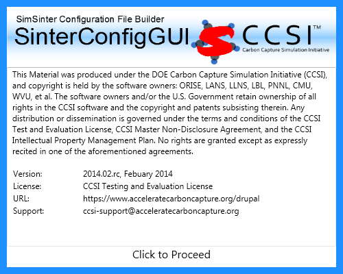
.. |image8| image:: ./media/image14.png
   :width: 5.76837in
   :height: 3.96576in
.. |image9| image:: ./media/image15.png
   :width: 5.88889in
   :height: 3.63411in
.. |image10| image:: ./media/image16.png
   :width: 5.76903in
   :height: 3.5625in
.. |image11| image:: ./media/image17.png
   :width: 5.86111in
   :height: 3.61111in
.. |image12| image:: ./media/image18.png
   :width: 6.07576in
   :height: 4.17708in
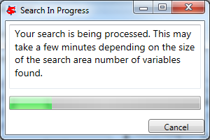
.. |image14| image:: ./media/image20.png
   :width: 5.95179in
   :height: 3.90936in
.. |image15| image:: ./media/image21.png
   :width: 6.01042in
   :height: 3.94787in
.. |image16| image:: ./media/image22.png
   :width: 5.98156in
   :height: 3.92891in
.. |image17| image:: ./media/image23.png
   :width: 5.98958in
   :height: 3.93418in
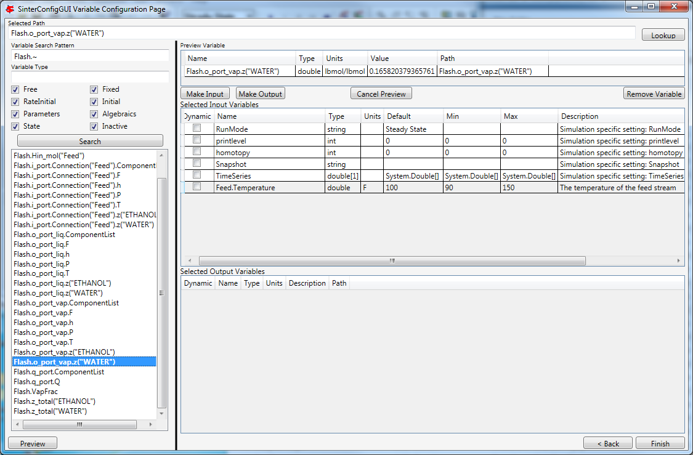
.. |image19| image:: ./media/image25.png
   :width: 5.87924in
   :height: 3.60731in
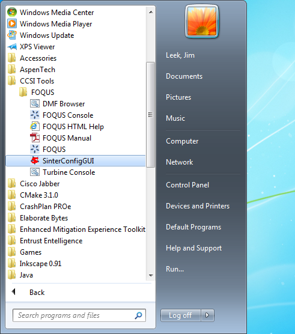

.. |image22| image:: ./media/image14.png
   :width: 5.95663in
   :height: 4.09518in
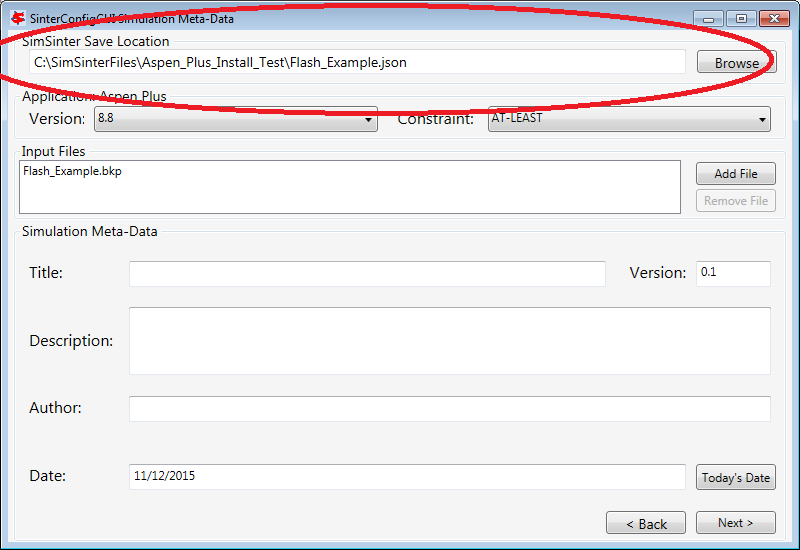
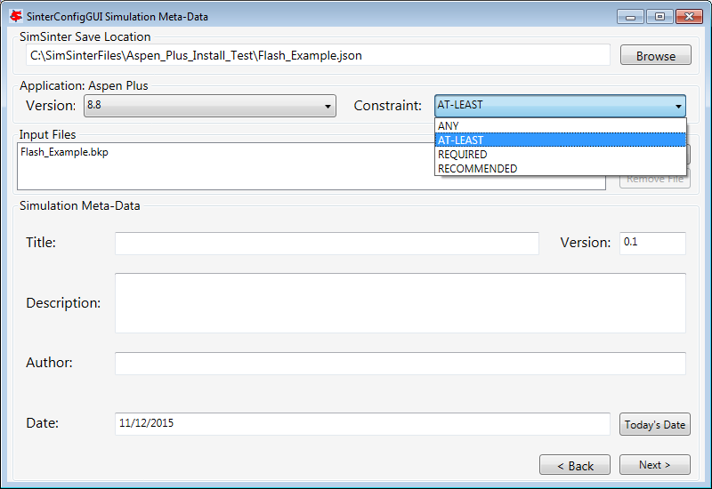
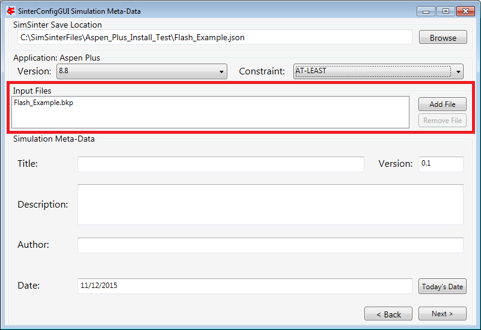
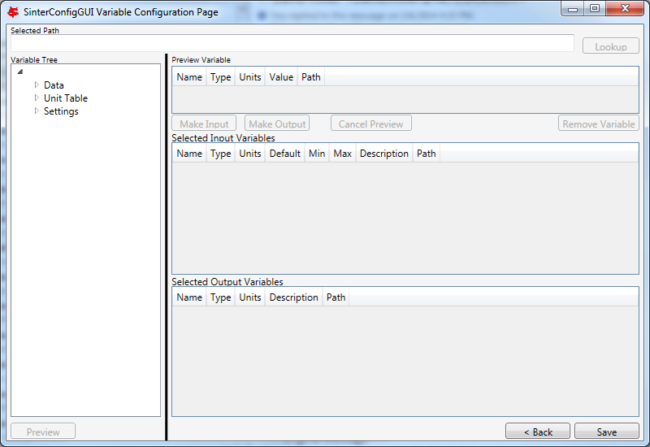
.. |image27| image:: ./media/image31.png
   :width: 6.00746in
   :height: 4.13013in
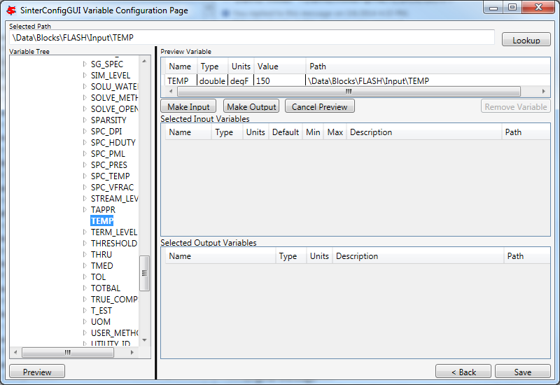
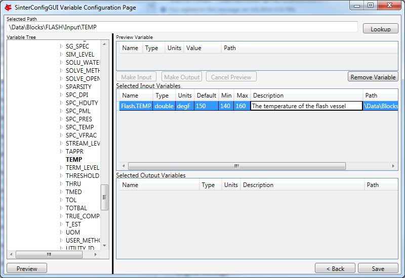
.. |image30| image:: ./media/image34.png
   :width: 5.93284in
   :height: 4.07882in
.. |image31| image:: ./media/image35.png
   :width: 2.83333in
   :height: 3.4in

.. |image33| image:: ./media/image14.png
   :width: 5.76837in
   :height: 3.96576in
.. |image34| image:: ./media/image36.png
   :width: 5.9375in
   :height: 4.08322in
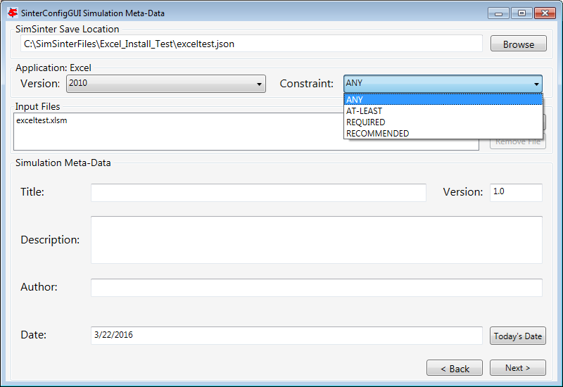
.. |image36| image:: ./media/image38.png
   :width: 5.77083in
   :height: 3.96455in
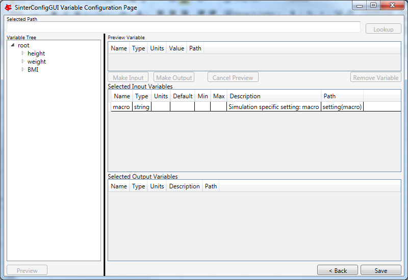
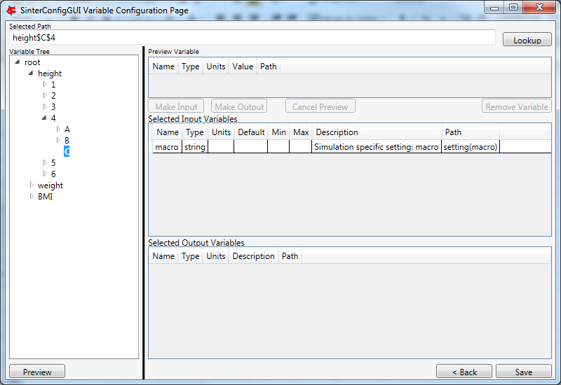
.. |image39| image:: ./media/image41.png
   :width: 6.5in
   :height: 4.46875in
.. |image40| image:: ./media/image42.png
   :width: 6.5in
   :height: 4.46875in

.. |image43| image:: ./media/image14.png
   :width: 5.76837in
   :height: 3.96576in
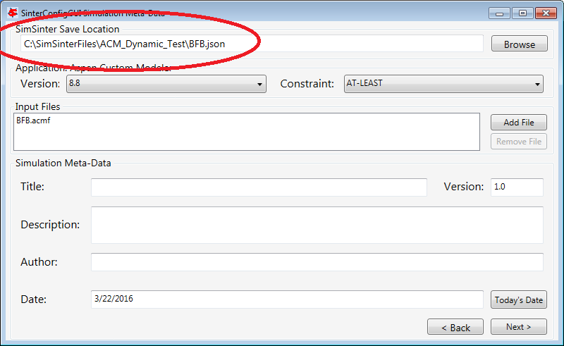
.. |image45| image:: ./media/image44.png
   :width: 5.57413in
   :height: 3.83333in
.. |image46| image:: ./media/image45.png
   :width: 5.69444in
   :height: 3.91607in
.. |image47| image:: ./media/image46.png
   :width: 6.5in
   :height: 4.29167in
.. |image48| image:: ./media/image47.png
   :width: 5.91432in
   :height: 4.06609in
.. |image49| image:: ./media/image48.png
   :width: 6.07292in
   :height: 4.17513in
.. |image50| image:: ./media/image49.png
   :width: 5.94792in
   :height: 3.9375in
.. |image51| image:: ./media/image50.png
   :width: 5.75in
   :height: 3.95313in

.. |image53| image:: ./media/image51.png
   :width: 5.76236in
   :height: 3.96163in
.. |image54| image:: ./media/image52.png
   :width: 5.95833in
   :height: 4.09635in
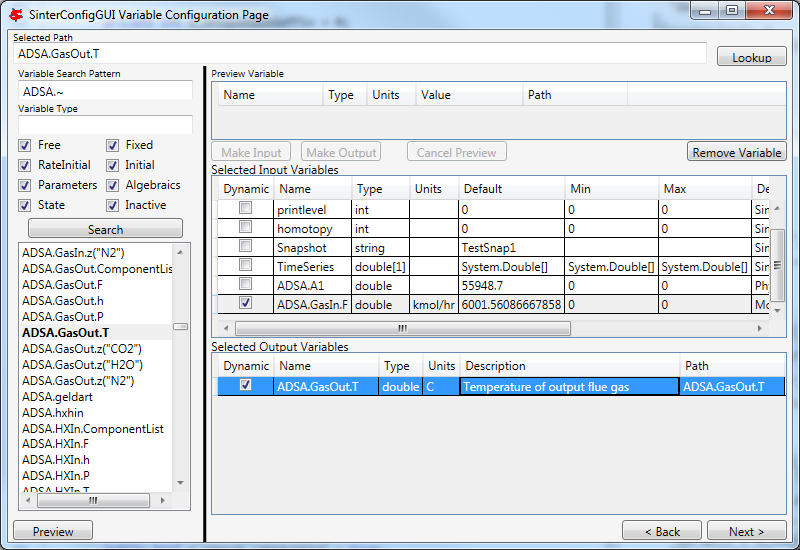
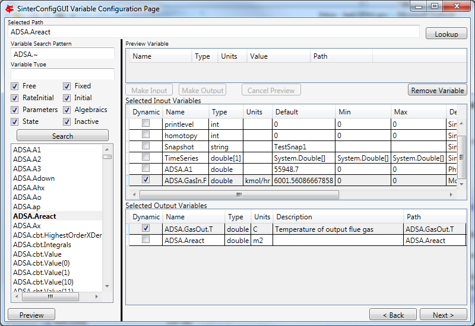
.. |image57| image:: ./media/image55.png
   :width: 5.63333in
   :height: 1.49199in
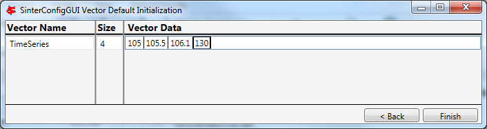
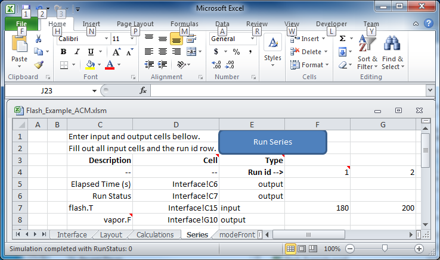
.. |image60| image:: ./media/image58.png
   :width: 6.08011in
   :height: 3.6in