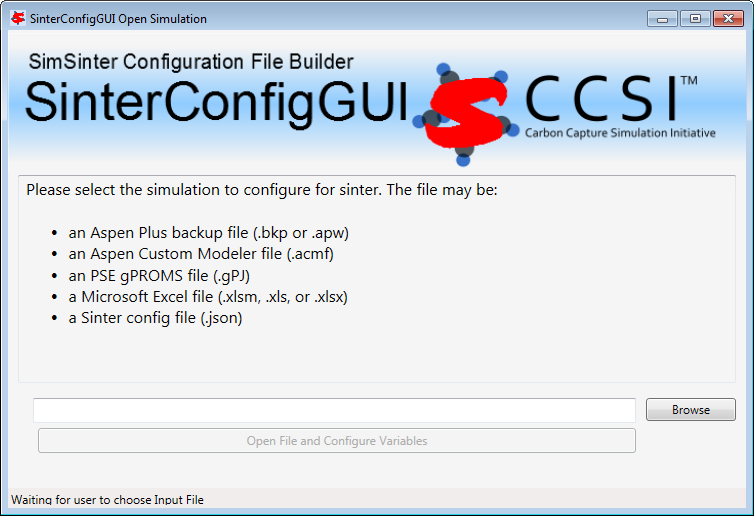
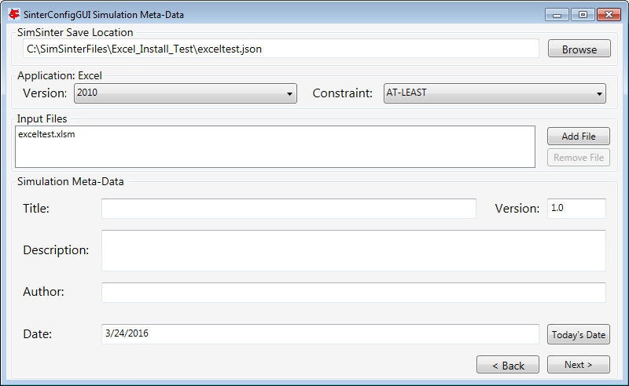
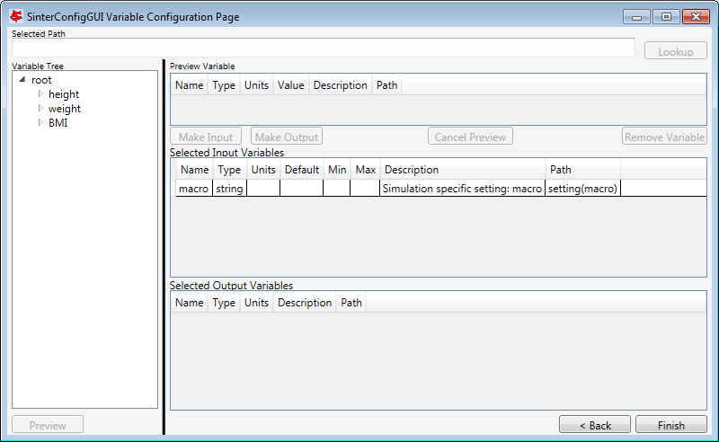
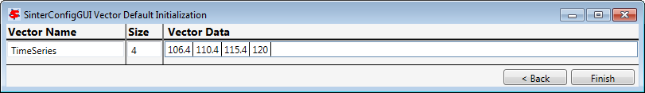

Usage Information
=================

SinterConfigGUI Hot-Keys
------------------------

The SinterConfigGUI is a program that helps users configure SimSinter to
work with their simulations. It is a series of pages that are distinct
steps in configuring the simulation. Each page has hot-keys that can be
used on that page.

**Initial Page / Open File Page**

|image61|

+----------------------+-------+--------------------------------------+
| Command              | Hot   | Explanation                          |
|                      | Key   |                                      |
+======================+=======+======================================+
| Open file browser    | C     | Standard Microsoft Open File hot-key |
|                      | TRL+O |                                      |
|                      |       | B for “Browse”                       |
|                      | C     |                                      |
|                      | TRL+B |                                      |
+----------------------+-------+--------------------------------------+

**Meta-Data Page**

|image62|

+--------------------------+------------+------------------------------+
| Command                  | Hot Key    | Explanation                  |
+==========================+============+==============================+
| Save (In current Save    | CTRL+S     | Standard Microsoft Save      |
| location)                |            | hot-key                      |
+--------------------------+------------+------------------------------+
| SaveAs (Browse to new    | F12        | Standard Microsoft Save As   |
| save location)           |            | hot-key                      |
+--------------------------+------------+------------------------------+
| Back / Reset             | Backspace  | Standard web browser ”back”  |
| SinterConfigGUI          |            | hot-key                      |
|                          | Alt-Left   |                              |
|                          |            | Standard web browser ”back”  |
|                          |            | hot-key                      |
+--------------------------+------------+------------------------------+
| Next / Go to Variable    | Shift      | Standard web browser         |
| Config Page              | +Backspace | ”forward” hot-key            |
|                          |            |                              |
|                          | Alt-Right  | Standard web browser         |
|                          |            | ”forward” hot-key            |
+--------------------------+------------+------------------------------+
| Add Additional Input     | CTRL+ “+”  | Stardard Microsoft “Add      |
| File                     |            | Item” hot-key                |
|                          | Insert     |                              |
|                          |            | Opposite of “Delete”         |
+--------------------------+------------+------------------------------+
| Remove File from         | CTRL+ “-”  | Stardard Microsoft “Remove   |
| Additional Input File    |            | Item” hot-key                |
| List                     | Delete     |                              |
|                          |            | Delete                       |
+--------------------------+------------+------------------------------+

**Variable Configuration Page**

|image63|

+----------------------+-----------+-----------------------------------+
| Command              | Hot Key   | Explanation                       |
+======================+===========+===================================+
| Save (In current     | CTRL+S    | Standard Microsoft Save hot-key   |
| Save location)       |           |                                   |
+----------------------+-----------+-----------------------------------+
| SaveAs (Browse to    | F12       | Standard Microsoft Save As        |
| new save location)   |           | hot-key                           |
+----------------------+-----------+-----------------------------------+
| Back / Go to         | Backspace | Standard web browser ”back”       |
| Meta-Data Page       |           | hot-key                           |
|                      | Alt-Left  |                                   |
|                      |           | Standard web browser ”back”       |
|                      |           | hot-key                           |
+----------------------+-----------+-----------------------------------+
| Next / Go to         | Shift+    | Standard web browser ”forward”    |
| Meta-Data Page       | Backspace | hot-key                           |
|                      |           |                                   |
|                      | Alt-Right | Standard web browser ”forward”    |
|                      |           | hot-key                           |
+----------------------+-----------+-----------------------------------+
| Preview Variable     | F2        | Standard Microsoft “Edit Field”   |
|                      |           | hot-key                           |
+----------------------+-----------+-----------------------------------+
| Make Preview an      | CTRL+I    | ‘I’ for “Input”                   |
| Input Variable       |           |                                   |
+----------------------+-----------+-----------------------------------+
| Make Preview an      | CTRL+O    | ‘O’ for “Output”                  |
| Output Variable      |           |                                   |
+----------------------+-----------+-----------------------------------+
| Remove Variable      | Delete    | Delete                            |
+----------------------+-----------+-----------------------------------+

**Vector Defaults Configuration Page**

|image64|

+----------------------+-----------+-----------------------------------+
| Command              | Hot Key   | Explanation                       |
+======================+===========+===================================+
| Save (In current     | CTRL+S    | Standard Microsoft Save hot-key   |
| Save location)       |           |                                   |
+----------------------+-----------+-----------------------------------+
| SaveAs (Browse to    | F12       | Standard Microsoft Save As        |
| new save location)   |           | hot-key                           |
+----------------------+-----------+-----------------------------------+
| Back / Goto Variable | Backspace | Standard web browser ”back”       |
| Config Page          |           | hot-key                           |
|                      | Alt-Left  |                                   |
|                      |           | Standard web browser ”back”       |
|                      |           | hot-key                           |
+----------------------+-----------+-----------------------------------+
| Next / Save and Quit | Shift+    | Standard web browser ”forward”    |
|                      | Backspace | hot-key                           |
|                      |           |                                   |
|                      | Alt-Right | Standard web browser ”forward”    |
|                      |           | hot-key                           |
+----------------------+-----------+-----------------------------------+

Unit of Measurement Handling
----------------------------

As of v3.0, the support for unit conversion on input variables has been
removed from SimSinter. If a Sinter configuration file defines a unit of
measurement for a given input variable, and the Sinter input file
declares a different type, SimSinter will display an error. If the input
file does not provide a unit string (units: “” or units: null) the value
is assumed to be in the same units as provided in the Sinter
configuration file.

SimSinter displays an error if the Sinter configuration units and
input file units are not the same, or if the input file defines a unit
but the Sinter configuration file does not. The lack of units in the
Sinter configuration file implies that the expected value is unitless,
so defining any unit for it is defining a
non-compatible.

Aspen Plus and ACM both take F and C as the symbols for Fahrenheit and
Celsius. By the international standard F and C represent Farads and
Coulombs, °F and °C represent Fahrenheit and Celsius. SimSinter does not
accept F and C for Fahrenheit and Celsius; however, a number of symbols
are permitted. For example, Celsius can be represented with °C, degC,
deg_C, degree_Celsius, celsius, degree_C, degrees_C, degree, degreesC,
degsC, and degs_C. SimSinter, SinterConfigGUI, defaults to “degC” to
represent Celsius.

If a user has JSON configuration files from earlier versions of Sinter,
the user may need to convert the files to use degF and degC. The old
versions use the Aspen symbols (F and C).

To practice with the unit conversion, edit the Sinter configuration and
input files used in the Units_Test described in the Installation Guide.

Using the Included Command Line Tools
-------------------------------------

The most common uses of the command line tools are covered in the
tutorial. This is a reference to ensure the command line arguments are
known:

**ConsoleSinter**

ConsoleSinter takes either three or four arguments depending on if the
user is using a Text or JSON format Sinter configuration file.

-  **JSON** – ConsoleSinter <JSON Sinter Config> <Input File> <Output
   File Name>

-  **Text** – ConsoleSinter <Text Sinter Config> <Defaults File> <Input
   File> <Output File Name>

The Defaults File is a simple JSON dictionary matching names to values.
The file can be generated automatically with the DefaultBuilder helper
tool.

The Input File can be in input format version 1 or 2. The file can be a
single run, or a JSON array of runs (as generated by TurbineClient).

When ConsoleSinter is run an output file is created with the Output File
Name, over writing any file that currently uses that name. The file is a
JSON array of outputs in output format 2, the same as is returned from
the Gateway or TurbineClient.

**CSVConsoleSinter**

CSVConsoleSinter takes three arguments:

CSVConsoleSinter <JSON Sinter Config> <CSV Input File> <CSV Output File
>

The Sinter Config file must be in JSON format.

The Input File is a .csv file with Sinter variable names in the first
row, and every subsequent row is a separate run with input values.

The Output File is a .csv file with Sinter variable names in the first
row. The subsequent rows are written with the outputs for those
variables from each run. Use caution as CSVConsoleSinter overwrites
whatever is in the file.

**DefaultBuilder**

Default builder takes two arguments:

DefaultBuilder <Sinter Config> <Output File Name>

The Sinter Config File can be either in Text or JSON format. It does not
matter which, although DefaultBuilder is intended for helping with Text
format files.

When DefaultBuilder is run an output file is created with the Output
File Name, overwriting any file that currently uses that name. The file
is in output format 1, a simple JSON dictionary of input variable names
and their matching values from the simulation.

